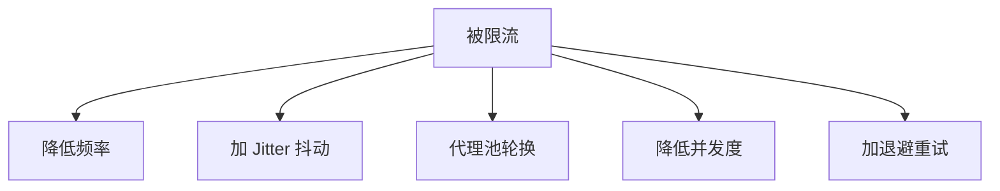
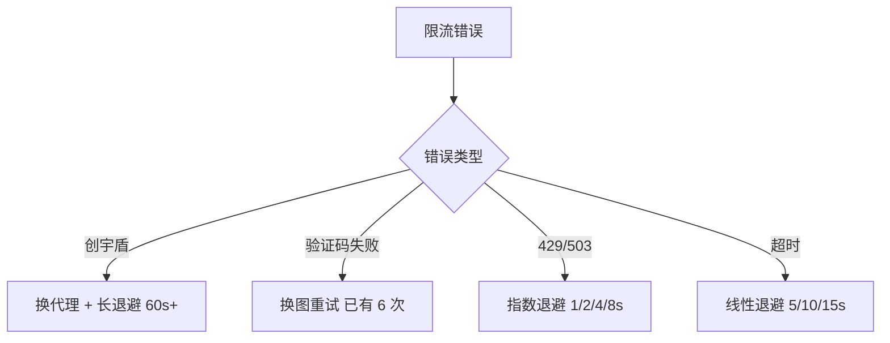

# 被限流怎么办

CNVD / 加速乐 / 创宇盾会对高频请求限流。本页给出识别与应对策略。

## 限流迹象

| 迹象 | 表现 |
|------|------|
| 创宇盾拦截 | `blocked by 创宇盾 (proxy may be banned)`，见 [代理被封](/faq/proxy-banned) |
| 验证码频繁触发 | 配置了 solver 但 `ErrCaptchaSolveFailed` 比例上升 |
| 响应变慢 | 单请求耗时显著增加 |
| HTTP 429 / 503 | 端点返回限流状态码 |

## 应对策略



## 1. 降低频率 + Jitter

请求间隔加随机抖动，避免固定节奏被识别。cnvd-skills 的 `Jitter` 配置（默认 0.3，范围 ±30%）控制翻页/详情间隔。详见 [Jitter 调参](/faq/jitter-tuning)。

## 2. 代理池轮换

每请求用不同代理 IP，分散单 IP 负载。详见 [代理与超时示例](/api-gojsl/examples/proxy-timeout)。

## 3. 降低并发度

并发过高易触发限流。用带缓冲 channel 控制并发数（见 [并发安全](/faq/concurrent-safe)）。建议并发 2-5 起步观察。

## 4. 退避重试

遇限流错误指数退避重试：

```go
func fetchWithBackoff(url string, max int) (string, error) {
    for i := 0; i < max; i++ {
        c := jsl.NewJslClient("", 60, solver)
        html, err := c.Get(context.Background(), url)
        if err == nil {
            return html, nil
        }
        if errors.Is(err, jsl.ErrCaptchaRequired) {
            return "", err // 不可重试
        }
        backoff := time.Duration(1<<uint(i)) * time.Second
        time.Sleep(backoff)
    }
    return "", fmt.Errorf("max retries exceeded")
}
```

## 退避策略选择



## 验证码本身是限流信号

加速乐在限流时会强制验证码挑战。`processCaptcha` 的 6 次重试已是对限流的一种应对；若仍频繁失败，说明被深度限流，需降频 + 换 IP。

## 相关

- [Jitter 调参](/faq/jitter-tuning)
- [代理被封排查](/faq/proxy-banned)
- [并发安全](/faq/concurrent-safe)
- [性能调优](/faq/performance)
