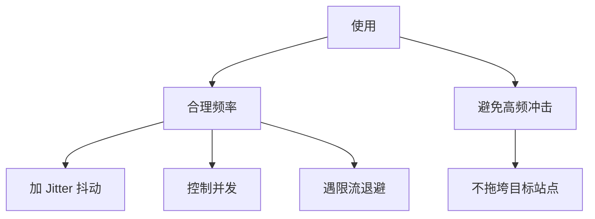

# 安全使用须知

使用 cnvd-skills / go-jsl 抓取 CNVD 时的安全与合规须知。

## 合规

- CNVD（国家信息安全漏洞共享平台）数据有版权与使用条款，抓取前请阅读 CNVD 站点声明。
- 仅用于合法的安全研究、漏洞情报汇总等用途，不得用于非法用途。
- 遵守目标站点的 `robots.txt` 与服务条款。

## 请求节奏

- 用 Jitter（默认 0.3）随机化间隔，见 [Jitter 调参](/faq/jitter-tuning)。
- 并发度 2-5 起步，见 [并发安全](/faq/concurrent-safe)。
- 遇限流退避，见 [被限流怎么办](/faq/rate-limit)。

## 代理使用

- 用自己的合法代理，不滥用公共代理。
- 代理被封时换 IP，不绕过反爬机制进行 DDoS 式访问。
- 见 [代理被封排查](/faq/proxy-banned)。

## 凭据安全

- 代理凭据、打码平台 API Key 等敏感信息不要硬编码，用环境变量或密钥管理。
- 不要把含真实代理 IP/密钥的 `config.yaml` 提交到 git（仓库已 `.gitignore`）。

## 数据处理

- 抓取的漏洞数据可能含敏感信息，妥善存储与访问控制。
- JSONL 输出解析见 [JSONL 输出解析](/faq/output-jsonl-parse)。

## 验证码识别

- ddddocr 等识别工具仅用于合法自动化，不用于绕过验证码进行滥用。
- 见 [ddddocr 安装](/faq/ddddocr-install)。

## 免责声明

本仓库为开源工具，使用者需自行承担合规与法律责任。作者不对滥用后果负责。

## 相关

- [被限流怎么办](/faq/rate-limit)
- [并发安全](/faq/concurrent-safe)
- [代理被封排查](/faq/proxy-banned)
- [Jitter 调参](/faq/jitter-tuning)
