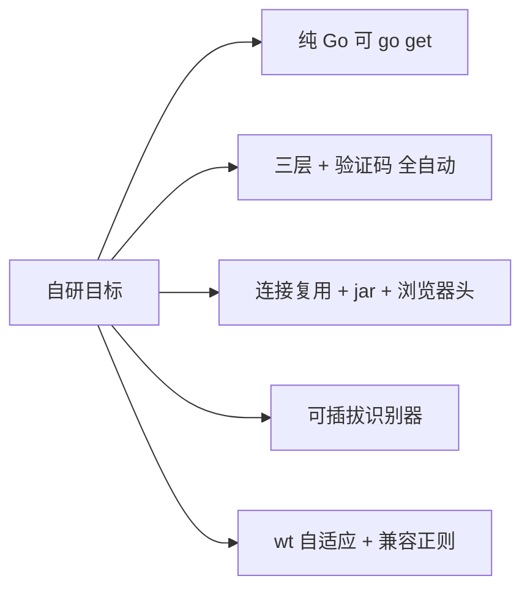
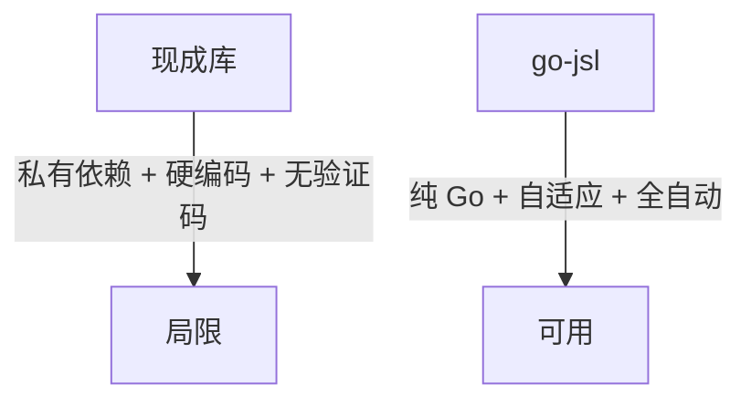

# 为何自研加速乐客户端

市面上已有若干加速乐（JSL）破解库，为何 cnvd-skills 选择自研 `go-jsl`？本页说明取舍。

## 现成库的局限

| 局限 | 影响 |
|------|------|
| 依赖私有 `jsl_sdk`（非公开包） | 无法 `go get`，monorepo 外不可用 |
| 正则不兼容 `; Max-age` 大小写 | 第一层 cookie 提取失败 |
| 硬编码 `wt=1500` | 加速乐调整 wt/vt 后失效 |
| 无验证码挑战处理 | 第三层返回验证码页时直接失败 |
| 无 UA 池与 Client Hints 联动 | 易被反爬特征化 |
| 无连接复用 / cookie jar | 每次新建 client，指纹抖动 |

## 自研目标

## go-jsl 的实现

- **纯 Go**：仅依赖 goja（JS 引擎）与 go-resty（HTTP），无私有依赖，`go get github.com/scagogogo/go-jsl` 即用。
- **三层 + 验证码全自动**：第一层 goja 求值 + 兼容正则；第二层 md5/sha1/sha256 暴力匹配；第三层带 cookie GET 并自动处理验证码挑战（取图→识别→提交→放行，最多 6 次重试）。
- **连接复用 + cookie jar**：长生命周期 resty client，复用 TCP/TLS，`net/http/cookiejar` 自动管理会话。
- **浏览器级 Header**：Client Hints（`sec-ch-ua*`）与 UA 大版本联动，Fetch Metadata（`Sec-Fetch-*`）齐全。
- **可插拔识别器**：`CaptchaSolver` 接口，内置 Noop/Static/Interactive/Command 四实现，`CommandCaptchaSolver` 配合 ddddocr 全自动。
- **wt 自适应**：用解析出的 `wt` 休眠（扣除计算耗时），不硬编码。

## 对比

详见 [README](https://github.com/scagogogo/cnvd-skills/blob/main/gojsl/README.md) 与 [移除 jsl_sdk 原因](/faq/jsl-sdk-removed)。

## 相关

- [移除私有 jsl_sdk 原因](/faq/jsl-sdk-removed)
- [架构 - 设计取舍](/architecture/design-decisions)
- [三层解密深度解析](/api-gojsl/three-layers-deep-dive)
