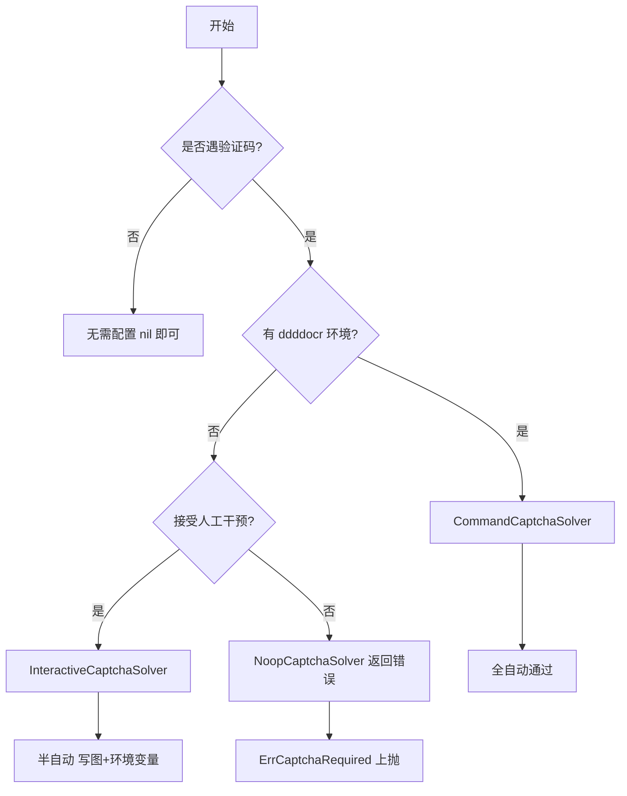
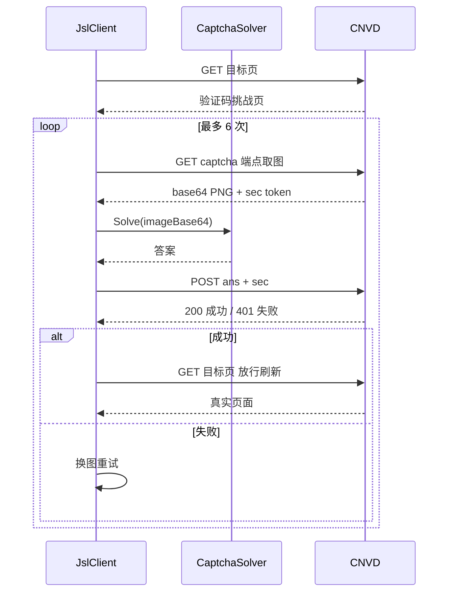

# 验证码识别器指南

CNVD 对部分 IP 会触发图片验证码挑战（创宇盾 captcha）。cnvd-skills 把"图→答案"这一步抽成 `CaptchaSolver` 接口，由调用方注入识别实现。库负责取图、提交、放行刷新、重试。

## CaptchaSolver 接口

接口定义在 go-jsl 包，仅一个方法：

```go
type CaptchaSolver interface {
    Solve(ctx context.Context, imageBase64 string) (string, error)
}
```

`imageBase64` 是 CNVD captcha 端点返回的 base64 PNG 图片数据，`Solve` 返回识别出的答案字符串。返回 error 表示无法识别，库会换一张图重试（最多 6 次）。

## 四种内置实现

| 实现 | 说明 | 适用场景 |
|------|------|------|
| `NoopCaptchaSolver` | 永不识别，返回 `ErrCaptchaRequired` | 明确要求调用方配识别器 |
| `StaticCaptchaSolver` | 返回固定答案/错误 | 单元测试 |
| `InteractiveCaptchaSolver` | 写图到临时目录 + 轮询环境变量读答案 | 人工/外部脚本配合 |
| `CommandCaptchaSolver` | 调外部命令识别：stdin 传 base64，stdout 读答案 | ddddocr 全自动 |

## Solver 选择决策树

根据是否遇验证码、是否有 ddddocr、是否需要人工，选择合适的识别器：



## 配置方式

`CaptchaSolver` 通过 `Config.CaptchaSolver` 注入，类型为 `jsl.CaptchaSolver`。仅在 `*WithConfig` 变体中生效：

```go
import (
    "github.com/scagogogo/cnvd-skills/cnvd_skills"
    "github.com/scagogogo/go-jsl"
)

cfg := &cnvd_skills.Config{
    MaxRetry:              3,
    RequestTimeoutSeconds: 30,
    CaptchaSolver: jsl.CommandCaptchaSolver{
        Command: "python3",
        Args:    []string{"scripts/ddddocr_solver.py"},
    },
}
detail, err := cnvd_skills.NewCnvdSkills().FetchVulDetailWithConfig(
    context.Background(), "CNVD-2021-67823",
    cnvd_skills.FixedProxyProvider(""), cfg,
)
```

## CommandCaptchaSolver（推荐）

调外部命令识别：把 base64 图片通过 stdin 传入命令，从 stdout 读取答案。命令退出码非 0 视为识别失败。配合 `scripts/ddddocr_solver.py` 可全自动通过 CNVD 中文词组验证码。

安装 ddddocr：

```bash
pip3 install ddddocr  # 受 PEP668 限制的系统加 --break-system-packages
```

配置：

```go
solver := jsl.CommandCaptchaSolver{
    Command: "python3",
    Args:    []string{"scripts/ddddocr_solver.py"},
}
```

`scripts/ddddocr_solver.py` 从 stdin 读 base64 PNG，用 ddddocr 识别后输出答案到 stdout。

## InteractiveCaptchaSolver

半自动识别器：把验证码图写到磁盘临时文件，然后轮询环境变量 `CNVD_CAPTCHA_ANSWER`（可配置）等待人工或外部脚本填入答案。读到答案后清空环境变量并返回。

```go
solver := jsl.InteractiveCaptchaSolver{
    AnswerEnv:    "CNVD_CAPTCHA_ANSWER",
    ImageDir:     "/tmp/cnvd-captcha",
    WaitTimeout:  5 * time.Minute,
    PollInterval: 1 * time.Second,
}
```

字段均可选，零值时用默认值。适合调试或无 ddddocr 环境时人工配合。

## NoopCaptchaSolver

永不识别，`Solve` 直接返回 `ErrCaptchaRequired`。用于明确要求调用方配置识别器的场景：遇到验证码即上抛错误。

```go
cfg := &cnvd_skills.Config{
    CaptchaSolver: jsl.NoopCaptchaSolver{},
}
```

不配置 `CaptchaSolver`（`nil`）时行为等价：库检测到验证码页且 `solver == nil` 即返回 `ErrCaptchaRequired`。

## StaticCaptchaSolver

返回固定答案或错误，仅供单元测试：

```go
solver := jsl.StaticCaptchaSolver{Answer: "测试答案"}
// 或模拟失败：jsl.StaticCaptchaSolver{Err: jsl.ErrCaptchaSolveFailed}
```

## 验证码流程

库内验证码挑战流程（go-jsl `JslClient.processCaptcha`）：检测到验证码页 → 取图 → 调 `solver.Solve` → POST 答案 → 放行刷新。失败自动换图重试最多 6 次。



## 错误处理

未配识别器遇验证码返回 `jsl.ErrCaptchaRequired`，多次识别失败返回 `jsl.ErrCaptchaSolveFailed`，均可用 `errors.Is` 判断：

```go
import "errors"

if errors.Is(err, jsl.ErrCaptchaRequired) {
    // 需配置识别器
}
if errors.Is(err, jsl.ErrCaptchaSolveFailed) {
    // 识别器返回错误或答案错误 6 次
}
```

`requestWithRetry` 对 `ErrCaptchaRequired` 不重试，直接上抛。详见 [代理与重试](./proxy-retry)。

## 下一步

- [配置](./config) CaptchaSolver 字段
- [go-jsl CaptchaSolver](/api-gojsl/captcha-solver) 接口文档
- [Solver 实现详解](/api-gojsl/solver-implementations) 四种实现源码
- [架构-验证码挑战](/architecture/captcha) 整体流程
