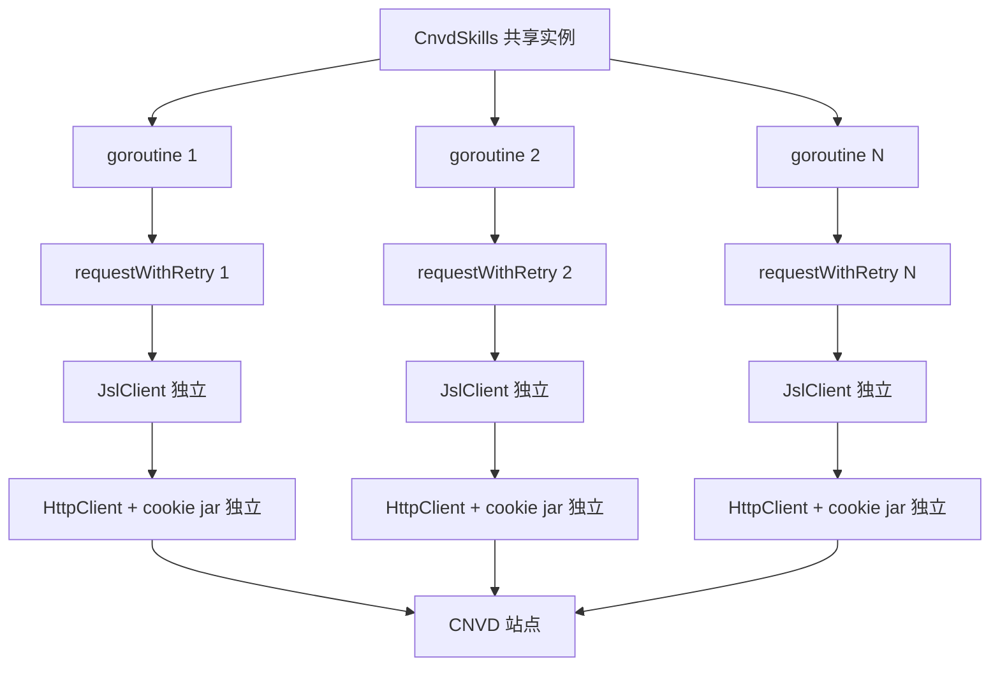

# 并发安全模型

`CnvdSkills` 持有一个默认 `jsl.JslClient` 实例（非并发安全），但带 config 的请求在 `requestWithRetry` 内按请求派生独立客户端，保证并发安全。

## CnvdSkills 结构

`CnvdSkills` 是 CNVD 抓取的入口，持有一个默认加速乐客户端实例：

```go
type CnvdSkills struct {
    jslClient *jsl.JslClient
}

func NewCnvdSkills() *CnvdSkills {
    return &CnvdSkills{
        jslClient: jsl.NewJslClient("", 0, nil),  // 直连、不限时、不配识别器
    }
}

func (x *CnvdSkills) JslClient() *jsl.JslClient {
    return x.jslClient  // 只读引用
}
```

`jslClient` 是共享实例，用于无 config 的简单请求场景。但 `JslClient` 内部持有 `HttpClient`（含 cookie jar），cookie jar 会随请求累积，因此一个 `JslClient` 实例**非并发安全**。

## requestWithRetry 的派生策略

带 config 的请求在 `requestWithRetry` 内每次尝试都 `jsl.NewJslClient(proxy, timeoutSec, solver)` 派生独立客户端，不修改共享实例：

```go
func (x *CnvdSkills) requestWithRetry(ctx, proxyProvider, config, targetUrl) (string, error) {
    proxy, _ := proxyProvider()
    for attempt := 0; attempt <= maxRetry; attempt++ {
        client := jsl.NewJslClient(proxy, timeoutSec, solver)  // 每次派生独立实例
        body, getErr := client.Get(ctx, targetUrl)
        // ...
    }
}
```

每个派生实例有自己的 `HttpClient` 与 cookie jar，互不影响。即使多个 goroutine 同时调用 `VulList` 或 `FetchVulDetail`，各自派生的客户端也不会共享 cookie 状态。

## 并发模型图

下图展示多个 goroutine 并发调用时，每个请求派生独立 `JslClient` 与 `HttpClient`：



## 并发调用示例

多个 goroutine 同时抓取不同 CNVD-ID，各自派生独立客户端，互不干扰：

```go
skills := cnvd_skills.NewCnvdSkills()
cfg := &cnvd_skills.Config{
    MaxRetry:              3,
    RequestTimeoutSeconds: 30,
    CaptchaSolver:         solver,
}

var wg sync.WaitGroup
cnvdIDs := []string{"CNVD-2021-67823", "CNVD-2021-67824", "CNVD-2021-67825"}
for _, id := range cnvdIDs {
    wg.Add(1)
    go func(cnvd string) {
        defer wg.Done()
        detail, err := skills.FetchVulDetailWithConfig(
            context.Background(), cnvd,
            cnvd_skills.FixedProxyProvider(""), cfg,
        )
        if err != nil {
            fmt.Println(cnvd, err)
            return
        }
        fmt.Println(cnvd, detail.CVE)
    }(id)
}
wg.Wait()
```

## HttpClient 为何非并发安全

`HttpClient` 持有长生命周期的 `*resty.Client` 与 cookie jar。cookie jar 会随请求累积 `Set-Cookie`，并发写同一 jar 会导致 cookie 状态混乱（加速乐三层解密算出的 `__jsl_clearance_s` 可能被其他 goroutine 的解密结果覆盖）。因此每个并发请求必须用独立 `HttpClient`，即独立 `JslClient`。

```go
type HttpClient struct {
    client *resty.Client  // 含 cookie jar，会累积
    mu     sync.Mutex
    ua     userAgent
}
```

> 注：`mu` 仅保护 `RefreshUserAgent` 轮换 UA，不保护 cookie jar 的并发写。

## 共享实例的边界

`CnvdSkills.JslClient()` 返回的共享实例**仅用于无 config 的简单请求场景**（普通版本的 `RequestVulDetailByID` 等，内部传 `nil` config）。但这些普通版本最终也走 `requestWithRetry`，`config == nil` 时 `maxRetry=0`、`timeoutSec=0`、`solver=nil`，仍会派生独立客户端（`jsl.NewJslClient(proxy, 0, nil)`），同样并发安全。

```go
// 这些都走 requestWithRetry，派生独立客户端，并发安全
skills.RequestVulDetailByID(ctx, "CNVD-xxx", proxy)
skills.RequestVulListByOffset(ctx, 0, proxy)
skills.RequestVulPatchByID(ctx, "289241", proxy)
```

## 直接使用 JslClient 的并发

若通过 `skills.JslClient()` 拿到共享实例直接调用 `Get`，则**非并发安全**（cookie jar 共享）。并发场景应自行 `jsl.NewJslClient` 派生独立实例：

```go
// 非并发安全（共享 jar）
client := skills.JslClient()
html, _ := client.Get(ctx, url)

// 并发安全（每次派生）
client := jsl.NewJslClient("", 30, solver)
html, _ := client.Get(ctx, url)
```

## 主流程的内部并发性

`VulList` 主流程是**串行**的：翻页 → 逐条详情 → 落盘，按 `jitterSleep` 节奏推进，内部无 goroutine。并发性体现在调用方可同时启动多个 `VulList` 或 `FetchVulDetail`，各自独立推进，互不影响。

## 关键 API

| 方法 | 说明 |
|------|------|
| `NewCnvdSkills() *CnvdSkills` | 构造入口，持有共享 jslClient |
| `JslClient() *jsl.JslClient` | 返回共享实例（只读，并发不安全） |
| `requestWithRetry(...)` | 内部方法，每次派生独立 JslClient |

## 下一步

- [代理与重试](./proxy-retry) requestWithRetry 重试机制
- [go-jsl JslClient](/api-gojsl/jsl-client) 客户端 API
- [go-jsl HttpClient](/api-gojsl/http-client) 统一 HTTP 客户端
- [架构-隐蔽性强化](/architecture/stealth) HttpClient 设计
