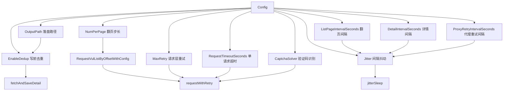
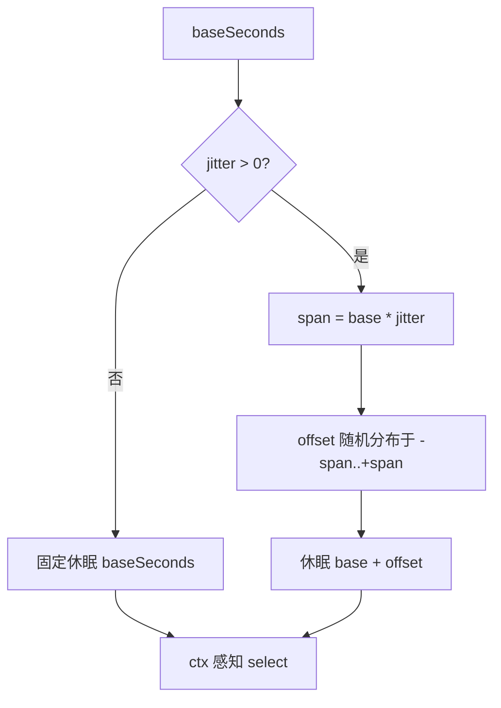

# 配置

`Config` 控制抓取输出、分页、节奏、重试、去重与验证码识别。`DefaultConfig()` 提供开箱即用的默认值，按需覆盖字段即可。

## 字段总览

| 字段 | 类型 | 默认 | 说明 |
|------|------|------|------|
| `OutputPath` | `string` | `data/test.jsonl` | 抓取结果输出路径，追加写入 |
| `NumPerPage` | `int` | 10 | 每页条数（CNVD 列表页固定为 10） |
| `ListPageIntervalSeconds` | `int` | 3 | 翻页间隔（秒） |
| `DetailIntervalSeconds` | `int` | 3 | 详情请求间隔（秒） |
| `ProxyRetryIntervalSeconds` | `int` | 3 | 代理失效重试间隔（秒） |
| `MaxRetry` | `int` | 3 | 单次请求最大重试次数（0=不重试） |
| `RequestTimeoutSeconds` | `int` | 30 | 单次请求超时（秒，0=不限） |
| `EnableDedup` | `bool` | `true` | 是否按 CNVD-ID 去重输出 |
| `Jitter` | `float64` | 0.3 | 间隔随机抖动幅度（0=关闭，0.5=±50%） |
| `CaptchaSolver` | `jsl.CaptchaSolver` | `nil` | 验证码识别器，不配则遇验证码返回 `ErrCaptchaRequired` |

## 字段依赖关系

各字段在主流程中作用的环节不同，下图展示字段如何驱动 `VulList` 的行为：



## 默认配置

`DefaultConfig()` 返回推荐默认值，未传 config 时主流程自动套用：

```go
func DefaultConfig() *Config {
    return &Config{
        OutputPath:                "data/test.jsonl",
        NumPerPage:                10,
        ListPageIntervalSeconds:   3,
        DetailIntervalSeconds:     3,
        ProxyRetryIntervalSeconds: 3,
        MaxRetry:                  3,
        RequestTimeoutSeconds:     30,
        EnableDedup:               true,
        Jitter:                    0.3,
    }
}
```

## 节奏抖动机制

所有间隔（翻页/详情/代理重试）经 `jitterSleep` 统一加抖动，模拟人类节奏，降低被反爬识别的概率。详见 [Jitter 节奏抖动](./jitter)：



## 示例：完整生产配置

```go
import (
    "github.com/scagogogo/cnvd-skills/cnvd_skills"
    "github.com/scagogogo/go-jsl"
)

cfg := &cnvd_skills.Config{
    OutputPath:                "data/cnvd.jsonl",
    NumPerPage:                10,
    ListPageIntervalSeconds:   5,
    DetailIntervalSeconds:     4,
    ProxyRetryIntervalSeconds: 3,
    MaxRetry:                  3,
    RequestTimeoutSeconds:     30,
    EnableDedup:               true,
    Jitter:                    0.5,
    CaptchaSolver: jsl.CommandCaptchaSolver{
        Command: "python3",
        Args:    []string{"scripts/ddddocr_solver.py"},
    },
}
```

## 各字段详解

### OutputPath

抓取结果输出文件路径。每行一个 `VulDetail` 的 JSON，追加写入（`O_CREATE|O_APPEND`）。配合 `EnableDedup` 支持断点续抓——重启后读取已抓 CNVD-ID 集合，跳过重复条目。

### NumPerPage

每页漏洞条目数，CNVD 列表页固定为 10，一般不改。`VulList` 内部按 `(page-1)*NumPerPage` 计算翻页 offset。

### ListPageIntervalSeconds / DetailIntervalSeconds

列表翻页、详情请求之间的休眠时长（秒）。实际休眠经 `jitterSleep` 随机化：`配置值 × (1 ± Jitter)`。

### ProxyRetryIntervalSeconds

代理失效后重试前的休眠时长（秒）。代理错误（TCP 读错误、EOF、连接拒绝、超时）触发换 IP 重试时使用。

### MaxRetry

单次请求最大重试次数。0 表示不重试，遇到非代理类错误直接返回。代理类错误不消耗 `MaxRetry` 配额（持续换 IP 重试），验证码类错误不重试直接上抛。详见 [代理与重试](./proxy-retry)。

### RequestTimeoutSeconds

单次请求超时（秒）。0 表示不设超时。建议生产环境设 30~60，避免单次请求无限挂起。

### EnableDedup

开启时，写文件前读取已抓 CNVD 集合，跳过重复条目。详见 [去重机制](./dedup)。

### Jitter

间隔随机抖动幅度（0~1）。0 = 关闭用固定间隔，0.5 = ±50%，默认 0.3。详见 [Jitter 节奏抖动](./jitter)。

### CaptchaSolver

验证码识别器，类型为 `jsl.CaptchaSolver` 接口。不配置则遇验证码返回 `jsl.ErrCaptchaRequired`。内置 Noop/Static/Interactive/Command 四种实现，详见 [验证码识别器指南](./captcha-solver-guide) 与 [go-jsl CaptchaSolver](/api-gojsl/captcha-solver)。

## WithConfig API 变体

需要传入 `CaptchaSolver` 等配置时，用 `*WithConfig` 变体（普通版本等价于传 `nil` 配置）：

- `RequestVulDetailByIDWithConfig` / `RequestVulDetailByURLWithConfig`
- `RequestVulListByOffsetWithConfig`
- `RequestVulPatchByIDWithConfig` / `RequestVulPatchByURLWithConfig`
- `RequestVulListByQueryWithConfig`
- `FetchVulDetailWithConfig`

详见 [WithConfig 对照](/api-cnvd-skills/withconfig-variants)。

## 下一步

- [Jitter 节奏抖动](./jitter) 抖动算法细节
- [去重机制](./dedup) EnableDedup 实现原理
- [代理与重试](./proxy-retry) MaxRetry 与代理重试协同
- [验证码识别器指南](./captcha-solver-guide) CaptchaSolver 配置
