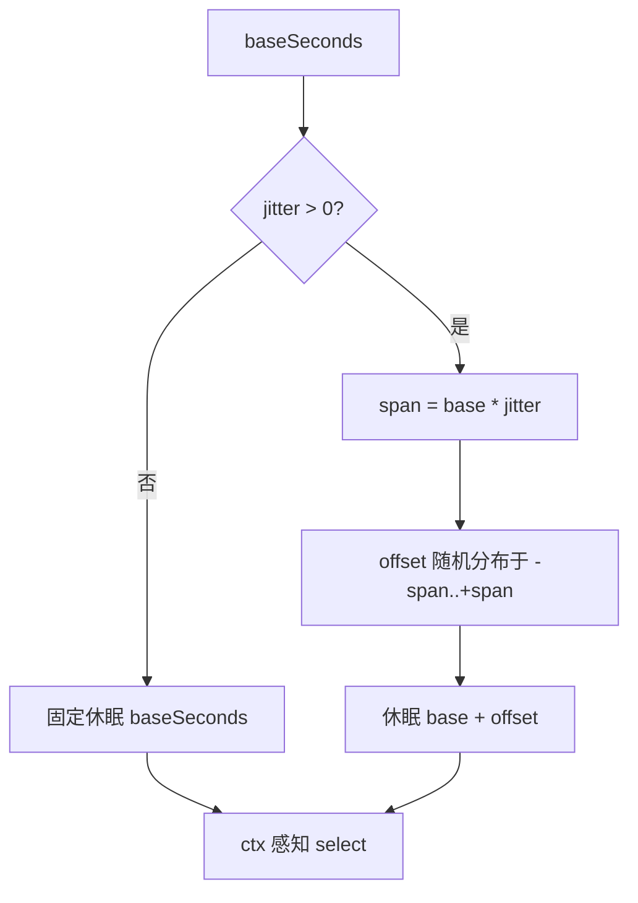

# 配置

`Config` 控制抓取输出、分页、节奏、重试与去重。`DefaultConfig()` 提供默认值。

## 字段

| 字段 | 默认 | 说明 |
|------|------|------|
| OutputPath | `data/test.jsonl` | 抓取结果输出路径 |
| NumPerPage | 10 | 每页条数 |
| ListPageIntervalSeconds | 3 | 翻页间隔（秒） |
| DetailIntervalSeconds | 3 | 详情请求间隔（秒） |
| ProxyRetryIntervalSeconds | 3 | 代理失效重试间隔（秒） |
| MaxRetry | 3 | 单次请求最大重试次数 |
| RequestTimeoutSeconds | 30 | 单次请求超时（秒，0=不限） |
| EnableDedup | true | 是否按 CNVD-ID 去重 |
| Jitter | 0.3 | 间隔随机抖动幅度（0=关闭，0.5=±50%） |
| CaptchaSolver | nil | 验证码识别器 |

## 节奏抖动机制

所有间隔（翻页/详情/代理重试）经 `jitterSleep` 统一加抖动，模拟人类节奏：



## 示例

```go
cfg := &cnvd_skills.Config{
    MaxRetry:              3,
    RequestTimeoutSeconds: 30,
    Jitter:                0.5,
    OutputPath:            "data/cnvd.jsonl",
    EnableDedup:           true,
    CaptchaSolver: jsl.CommandCaptchaSolver{
        Command: "python3",
        Args:    []string{"scripts/ddddocr_solver.py"},
    },
}
```

## 各字段详解

### OutputPath

抓取结果输出文件路径。每行一个 `VulDetail` 的 JSON，追加写入。配合 `EnableDedup` 支持断点续抓。

### NumPerPage

每页漏洞条目数，CNVD 列表页固定为 10，一般不改。

### ListPageIntervalSeconds / DetailIntervalSeconds

列表翻页、详情请求之间的休眠时长（秒）。实际休眠 = 配置值 × (1 ± Jitter)。

### ProxyRetryIntervalSeconds

代理失效后重试前的休眠时长（秒）。

### MaxRetry

单次请求最大重试次数。0 表示不重试，遇到非代理类错误直接返回。

### RequestTimeoutSeconds

单次请求超时（秒）。0 表示不设超时。建议生产环境设 30~60。

### EnableDedup

开启时，写文件前读取已抓 CNVD 集合，跳过重复条目，支持断点续抓。

### Jitter

间隔随机抖动幅度（0~1）。0 = 关闭用固定间隔，0.5 = ±50%，默认 0.3。

### CaptchaSolver

验证码识别器。不配置则遇验证码返回 `jsl.ErrCaptchaRequired`。详见 [go-jsl CaptchaSolver](/api-gojsl/captcha-solver)。
