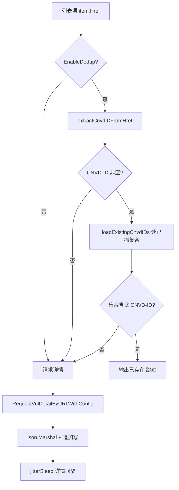

# 去重机制

`Config.EnableDedup` 开启时，写文件前读取已抓 CNVD-ID 集合，跳过重复条目，支持断点续抓。默认 `true`。

## 去重原理

去重基于 CNVD-ID（如 `CNVD-2021-67823`），从输出文件每行的 JSON 中提取 `CNVD` 字段构建集合，再从列表项的 `Href` 中提取 CNVD-ID 判断是否已存在。

涉及两个内部函数：

| 函数 | 作用 |
|------|------|
| `loadExistingCnvdIDs(outputPath)` | 读输出文件，返回已抓 CNVD-ID 集合 |
| `extractCnvdIDFromHref(href)` | 从列表项相对链接提取 CNVD-ID |

## loadExistingCnvdIDs

读取输出文件，逐行解析 JSON 提取 `CNVD` 字段。文件不存在返回空集合，解析失败的行跳过：

```go
func loadExistingCnvdIDs(outputPath string) map[string]struct{} {
    existed := make(map[string]struct{})
    data, err := os.ReadFile(outputPath)
    if err != nil {
        return existed  // 文件不存在返回空集合
    }
    for _, line := range bytes.Split(data, []byte("\n")) {
        line = bytes.TrimSpace(line)
        if len(line) == 0 {
            continue
        }
        var record struct {
            CNVD string `json:"CNVD"`
        }
        if err := json.Unmarshal(line, &record); err != nil {
            continue  // 解析失败跳过
        }
        if record.CNVD != "" {
            existed[record.CNVD] = struct{}{}
        }
    }
    return existed
}
```

只解析 `CNVD` 字段（用匿名结构体），不反序列化整个 `VulDetail`，性能优于全量解析。

## extractCnvdIDFromHref

从列表项相对链接提取 CNVD-ID。输入 `/flaw/show/CNVD-2021-67823`，返回 `CNVD-2021-67823`：

```go
func extractCnvdIDFromHref(href string) string {
    href = strings.TrimSpace(href)
    idx := strings.Index(href, "CNVD-")
    if idx < 0 {
        return ""
    }
    return href[idx:]
}
```

无法提取（不含 `CNVD-` 前缀）返回空串，调用方据此判断是否跳过。

## 去重流程

`fetchAndSaveDetail` 在请求详情前先判断是否已存在：



## 用法

默认开启，无需额外配置：

```go
cfg := cnvd_skills.DefaultConfig()  // EnableDedup 默认 true
err := skills.VulList(ctx, proxy, cfg)
```

关闭去重（每次都重新抓取并追加写入，会产生重复行）：

```go
cfg := cnvd_skills.DefaultConfig()
cfg.EnableDedup = false
```

## 断点续抓场景

去重机制天然支持断点续抓。进程被中断后重启，已写入 `data/test.jsonl` 的条目会被 `loadExistingCnvdIDs` 读入集合，重复的 CNVD-ID 直接跳过，只抓取新增部分：

```bash
# 第一次抓取，中断
./cnvd-skills  # 抓到 CNVD-2021-67823 后 Ctrl+C

# 第二次重启，自动跳过已抓的
./cnvd-skills  # 输出：已存在，跳过： CNVD-2021-67823
```

## 注意事项

- 去重基于 CNVD-ID，`extractCnvdIDFromHref` 提取失败（链接不含 `CNVD-`）时不去重，直接抓取
- `loadExistingCnvdIDs` 在每次 `fetchAndSaveDetail` 调用时都读文件，大文件场景下有 IO 开销。如需优化，可在外部缓存集合
- 关闭 `EnableDedup` 后，重复运行会产生重复行，需调用方自行去重

## 关键 API

| 函数 | 签名 |
|------|------|
| `loadExistingCnvdIDs` | `(outputPath string) map[string]struct{}`（内部） |
| `extractCnvdIDFromHref` | `(href string) string`（内部） |

均为包内私有函数，通过 `Config.EnableDedup` 间接控制。

## 下一步

- [输出格式](./output-format) JSONL 结构
- [配置](./config) EnableDedup 字段
- [漏洞列表抓取](./vul-list) 主流程
