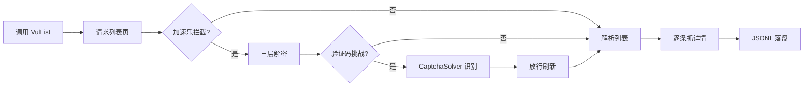

# 快速开始

cnvd-skills 是对 CNVD（国家信息安全漏洞共享平台）的 Go 封装，提供 CLI 与 SDK 两种用法，自动穿透加速乐三层加密与验证码挑战。

## 数据流总览



## 安装

见 [安装指南](./installation)。

## 最小示例

```go
package main

import (
    "context"
    "fmt"
    "github.com/scagogogo/cnvd-skills/cnvd_skills"
)

func main() {
    err := cnvd_skills.NewCnvdSkills().VulList(
        context.Background(),
        cnvd_skills.FixedProxyProvider(""), // 空串=直连
        cnvd_skills.DefaultConfig(),
    )
    fmt.Println(err)
}
```

## 下一步

- [配置](./config) 调整抓取节奏与去重
- [漏洞列表抓取](./vul-list) 了解主流程细节
- [架构总览](/architecture/overview) 理解三层解密与验证码挑战
