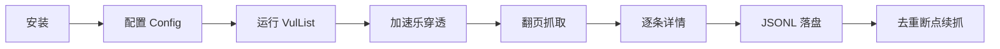
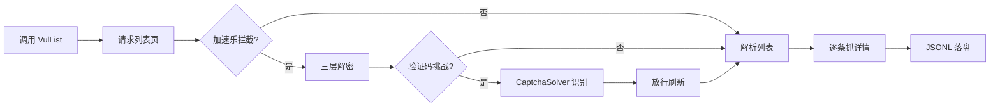

# 快速开始

cnvd-skills 是对 CNVD（国家信息安全漏洞共享平台）的 Go 封装，提供 CLI 与 SDK 两种用法，自动穿透加速乐三层加密与图片验证码挑战。本页用 5 分钟带你跑通第一次抓取。

## 整体流程

从安装到产出 JSONL 文件，经历四个阶段：安装 CLI/库 → 配置代理与节奏 → 运行主流程 → 落盘去重。



## 安装

见 [安装指南](./installation)。两种主流方式：

```bash
# 方式一：源码编译（monorepo 内，go-jsl 通过本地 replace 引用）
git clone https://github.com/scagogogo/cnvd-skills.git
cd cnvd-skills && go build -o cnvd-skills .

# 方式二：作为 Go SDK 引入
go get github.com/scagogogo/cnvd-skills
```

## 最小示例

直连 CNVD、默认配置、抓取全量漏洞列表并逐条落盘到 `data/test.jsonl`：

```go
package main

import (
    "context"
    "fmt"
    "github.com/scagogogo/cnvd-skills/cnvd_skills"
)

func main() {
    err := cnvd_skills.NewCnvdSkills().VulList(
        context.Background(),
        cnvd_skills.FixedProxyProvider(""), // 空串=直连
        cnvd_skills.DefaultConfig(),
    )
    if err != nil {
        fmt.Println("抓取出错： " + err.Error())
    }
}
```

直连场景遇验证码会返回 `ErrCaptchaRequired`，需要配置识别器才能自动通过，见 [验证码识别器指南](./captcha-solver-guide)。

## 带验证码识别器的示例

CNVD 对部分 IP 会触发图片验证码挑战。配置 `CommandCaptchaSolver` 调用 ddddocr 即可全自动通过：

```go
package main

import (
    "context"
    "fmt"
    "github.com/scagogogo/cnvd-skills/cnvd_skills"
    "github.com/scagogogo/go-jsl"
)

func main() {
    cfg := &cnvd_skills.Config{
        MaxRetry:              3,
        RequestTimeoutSeconds: 30,
        CaptchaSolver: jsl.CommandCaptchaSolver{
            Command: "python3",
            Args:    []string{"scripts/ddddocr_solver.py"},
        },
    }
    err := cnvd_skills.NewCnvdSkills().VulList(
        context.Background(),
        cnvd_skills.FixedProxyProvider(""),
        cfg,
    )
    fmt.Println(err)
}
```

## 运行结果

运行后在 `data/test.jsonl` 看到逐行 JSON，每行是一个 `VulDetail`：

```json
{"CNVD":"CNVD-2021-67823","CVE":"CVE-2021-39149","Product":"...","Description":"..."}
```

`EnableDedup` 默认开启，重复抓取会自动跳过已存在的 CNVD-ID，支持断点续抓。详见 [输出格式](./output-format) 与 [去重机制](./dedup)。

## 数据流总览

主流程内部从列表到详情的完整数据流，包含加速乐穿透与验证码挑战两条分支：



## 下一步

- [安装](./installation) 选择适合你的安装方式
- [配置](./config) 调整抓取节奏与去重
- [漏洞列表抓取](./vul-list) 了解主流程细节
- [CLI 直接运行](./quickstart-cli) 不写代码直接跑
- [常见问题排查](./troubleshooting) 遇到错误先看这里
- [架构总览](/architecture/overview) 理解三层解密与验证码挑战
