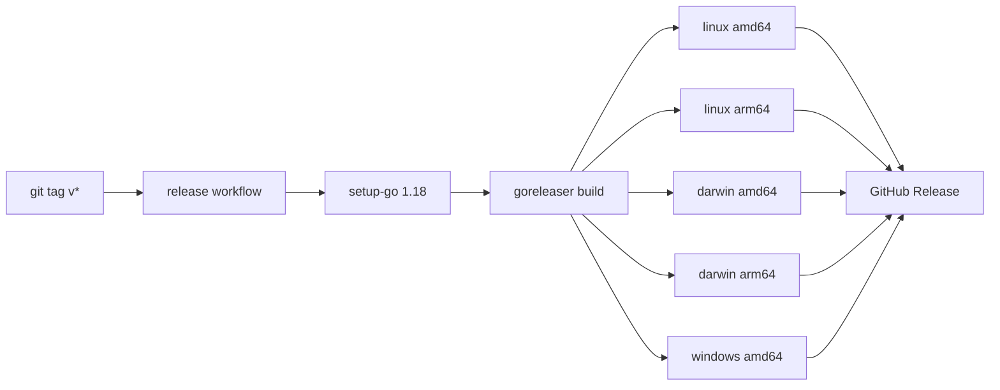
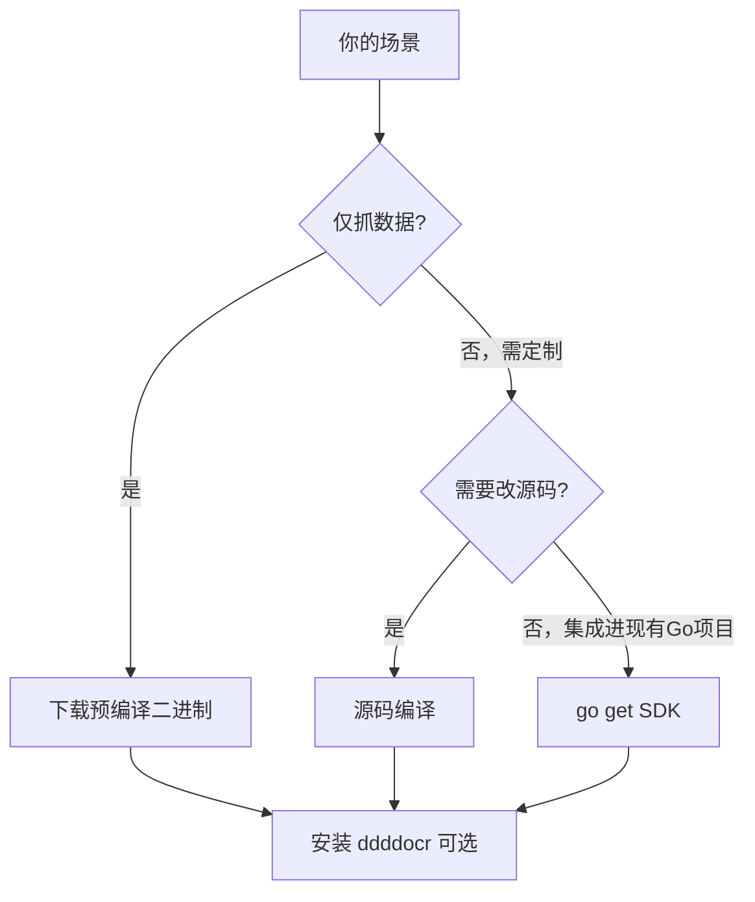

# 安装

cnvd-skills 提供两种安装方式：预编译 CLI 二进制（适合直接使用）与源码编译（适合二次开发）。作为 Go SDK 引用时直接 `go get`。

## 方式一：预编译 CLI 二进制（推荐）

从 [GitHub Releases](https://github.com/scagogogo/cnvd-skills/releases) 下载对应平台的压缩包，解压后得到 `cnvd-skills` 可执行文件，无需安装 Go 环境。

```bash
# Linux amd64 示例
tar -xzf cnvd-skills_*_linux_amd64.tar.gz
chmod +x cnvd-skills
./cnvd-skills
```

发布流水线由 goreleaser 驱动，覆盖以下平台矩阵。打 `git tag v*` 触发 release workflow，构建并上传各平台产物到 GitHub Release：



> windows arm64 不构建（CNVD 工具场景无需）。各平台产物为 tar.gz（Windows 为 zip），内含单一可执行文件。

## 方式二：从源码编译

需要本地安装 Go 1.18+。源码编译在 monorepo 内进行，go-jsl 子模块通过本地 `replace` 引用：

```bash
git clone https://github.com/scagogogo/cnvd-skills.git
cd cnvd-skills
go build -o cnvd-skills .
./cnvd-skills
```

构建产物 `cnvd-skills` 即 `main.go` 编译结果，调用 `cnvd_skills.NewCnvdSkills().VulList(...)` 主流程。详见 [CLI 直接运行](./quickstart-cli)。

> 注：go-jsl 子模块通过本地 `replace` 引用，源码编译需在 monorepo 内进行；外部 `go get github.com/scagogogo/cnvd-skills` 暂不可用（go-jsl 未独立发布到 proxy）。

## 方式三：作为 Go SDK 引入

在已有 Go 项目中作为库使用，引入 `cnvd_skills` 包即可调用全部 API：

```bash
go get github.com/scagogogo/cnvd-skills
```

```go
import "github.com/scagogogo/cnvd-skills/cnvd_skills"

skills := cnvd_skills.NewCnvdSkills()
detail, err := skills.FetchVulDetail(context.Background(), "CNVD-2021-67823", cnvd_skills.FixedProxyProvider(""))
```

## 验证码识别依赖（可选）

若 CNVD 触发验证码，需配置识别器。推荐 ddddocr，仓库自带 `scripts/ddddocr_solver.py` 包装脚本，由 `CommandCaptchaSolver` 调用：

```bash
pip3 install ddddocr  # 受 PEP668 限制的系统加 --break-system-packages
```

安装后即可在 `Config.CaptchaSolver` 配置 `jsl.CommandCaptchaSolver{Command: "python3", Args: []string{"scripts/ddddocr_solver.py"}}`，详见 [验证码识别器指南](./captcha-solver-guide) 与 [架构-验证码挑战](/architecture/captcha)。

## 验证安装

```bash
# 验证二进制可执行
./cnvd-skills --help 2>&1 || ./cnvd-skills

# 验证 SDK 可编译
go build ./...
```

## 平台选择建议



## 下一步

- [快速开始](./getting-started) 跑通第一次抓取
- [CLI 直接运行](./quickstart-cli) 命令行使用
- [配置](./config) 调整抓取参数
