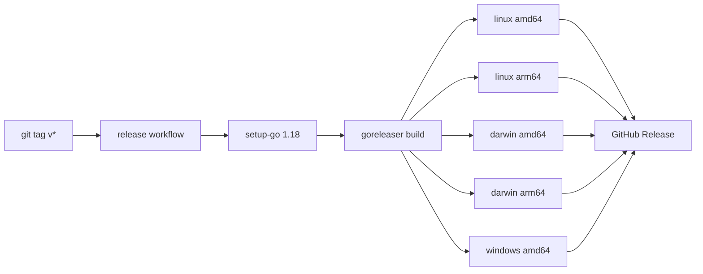

# 安装

## 方式一：预编译 CLI 二进制（推荐）

从 [GitHub Releases](https://github.com/scagogogo/cnvd-skills/releases) 下载对应平台的压缩包，解压后得到 `cnvd-skills` 可执行文件。

```bash
# Linux amd64 示例
tar -xzf cnvd-skills_*_linux_amd64.tar.gz
./cnvd-skills
```

发布流水线由 goreleaser 驱动，覆盖以下平台：



> windows arm64 不构建（CNVD 工具场景无需）。

## 方式二：从源码编译

```bash
git clone https://github.com/scagogogo/cnvd-skills.git
cd cnvd-skills
go build -o cnvd-skills .
```

> 注：go-jsl 子模块通过本地 `replace` 引用，源码编译需在 monorepo 内进行；外部 `go get github.com/scagogogo/cnvd-skills` 暂不可用（go-jsl 未独立发布到 proxy）。

## 验证码识别依赖（可选）

若 CNVD 触发验证码，需配置识别器。推荐 ddddocr：

```bash
pip3 install ddddocr  # 受 PEP668 限制的系统加 --break-system-packages
```

仓库自带 `scripts/ddddocr_solver.py`，由 `CommandCaptchaSolver` 调用。详见 [验证码挑战](/architecture/captcha)。
