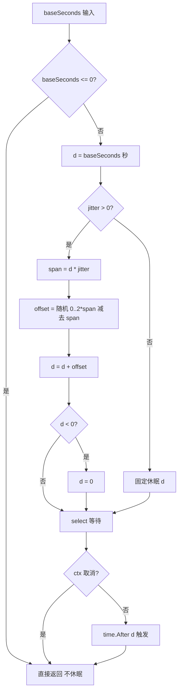
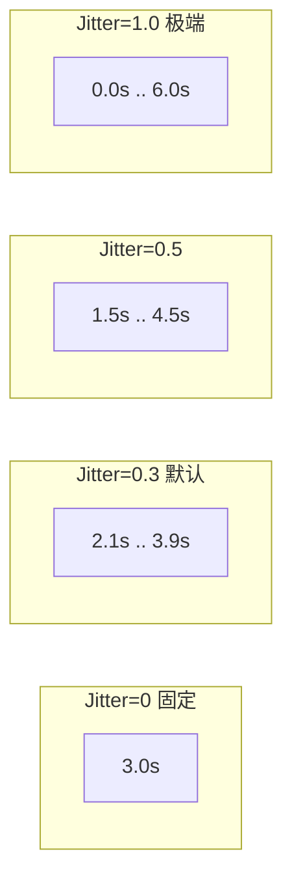
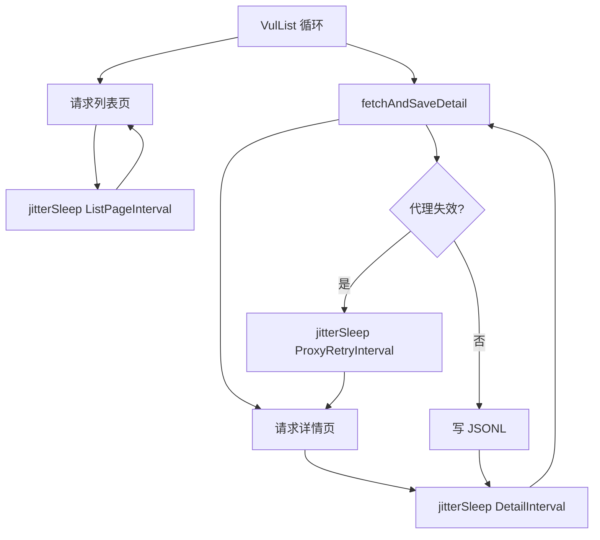

# Jitter 节奏抖动

`Config.Jitter` 控制翻页/详情/代理重试间隔的随机抖动幅度，模拟人类浏览节奏，降低被反爬识别为机器的概率。默认 0.3（±30%）。

## jitterSleep 函数

所有休眠统一经 `jitterSleep` 处理，传入基础秒数与抖动幅度，输出随机化后的休眠时长：

```go
func jitterSleep(ctx context.Context, baseSeconds int, jitter float64) {
    if baseSeconds <= 0 {
        return
    }
    d := time.Duration(baseSeconds) * time.Second
    if jitter > 0 {
        span := float64(d) * jitter
        offset := time.Duration(globalRand.Float64()*2*span) - time.Duration(span)
        d = d + offset
        if d < 0 {
            d = 0
        }
    }
    select {
    case <-ctx.Done():
    case <-time.After(d):
    }
}
```

## 抖动算法

`Jitter=0` 时固定休眠 `baseSeconds`；`Jitter>0` 时休眠时长在 `[base*(1-jitter), base*(1+jitter)]` 范围内均匀分布：



## 抖动范围可视化

不同 `Jitter` 值下，3 秒基础间隔的实际休眠范围：



`Jitter=0.3`（默认）时，3 秒间隔实际休眠在 2.1~3.9 秒之间均匀分布；`Jitter=0.5` 时范围扩大到 1.5~4.5 秒；`Jitter=1.0` 是理论上限，可能产生 0 秒休眠。

## 随机数源

`globalRand` 是包级 `rand.New(rand.NewSource(time.Now().UnixNano()))`，显式用时间戳播种。Go 1.18+ 包级 `rand` 不会自动 seed，显式播种避免每次进程启动产生固定序列：

```go
var globalRand = rand.New(rand.NewSource(time.Now().UnixNano()))
```

## 应用场景

`jitterSleep` 在三个场景被调用：

| 调用点 | baseSeconds | 说明 |
|------|------|------|
| `VulList` 翻页间隔 | `ListPageIntervalSeconds` | 每翻一页后休眠 |
| `fetchAndSaveDetail` 详情间隔 | `DetailIntervalSeconds` | 每抓一条详情后休眠 |
| `VulList` / `fetchAndSaveDetail` 代理重试 | `ProxyRetryIntervalSeconds` | 代理失效换 IP 前休眠 |



## ctx 感知

`jitterSleep` 内部用 `select` 同时监听 `ctx.Done()` 与 `time.After(d)`，ctx 取消时立即返回，不等待休眠结束。这保证主流程能及时响应外部取消信号。

## 配置建议

| 场景 | Jitter 建议 |
|------|------|
| 测试/调试 | 0（固定间隔，便于观察） |
| 生产抓取 | 0.3（默认，平衡隐蔽性与效率） |
| 高隐蔽需求 | 0.5（更大随机性） |
| 极端隐蔽 | 0.7~1.0（接近人类不规则节奏，效率降低） |

```go
cfg := &cnvd_skills.Config{
    Jitter:                  0.5,
    ListPageIntervalSeconds: 5,
    DetailIntervalSeconds:   4,
}
```

## 验证码识别的独立抖动

验证码流程内部另有抖动：`processCaptcha` 在每次取图前加 500~1500ms 随机延迟，模拟人类看图反应。该抖动不受 `Config.Jitter` 控制，是 go-jsl 内部固定行为。详见 [架构-隐蔽性强化](/architecture/stealth)。

## 下一步

- [配置](./config) Jitter 字段说明
- [并发安全模型](./concurrency) jitterSleep 的并发使用
- [架构-隐蔽性强化](/architecture/stealth) 整体隐蔽性策略
