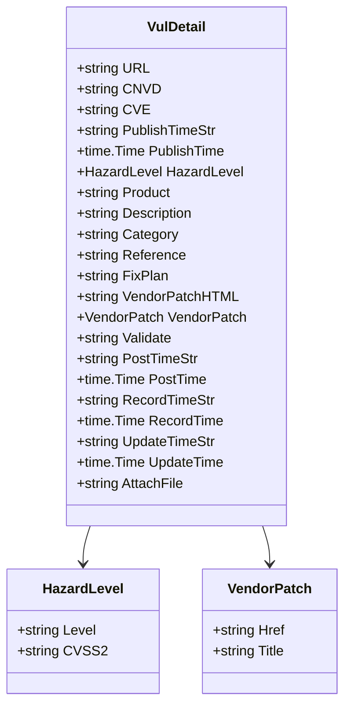
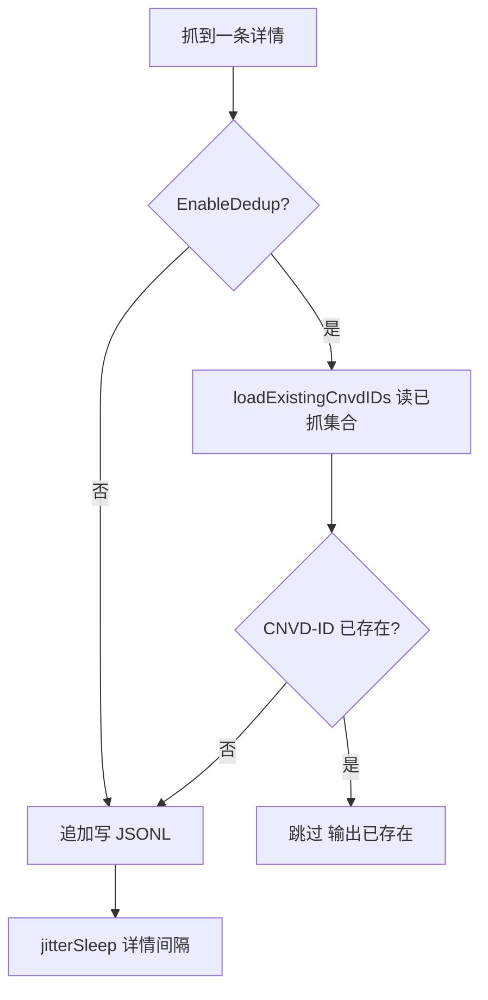

# 输出格式

cnvd-skills 的主流程 `VulList` / `VulListWithQuery` 把抓取结果以 JSONL（JSON Lines）格式落盘到 `Config.OutputPath`，每行一个 `VulDetail` 的 JSON，追加写入。

## JSONL 结构

JSONL 即每行一个独立 JSON 对象，行与行之间无逗号分隔，便于流式处理与断点续抓：

```json
{"CNVD":"CNVD-2021-67823","CVE":"CVE-2021-39149","Product":"...","Description":"..."}
{"CNVD":"CNVD-2021-67824","CVE":"CVE-2021-39150","Product":"...","Description":"..."}
```

每行是 `VulDetail` 的 `json.Marshal` 结果加换行符 `\n`。落盘逻辑在 `fetchAndSaveDetail`：

```go
marshal, err := json.Marshal(detail)
marshal = append(marshal, '\n')
file, _ := os.OpenFile(config.OutputPath, os.O_CREATE|os.O_WRONLY|os.O_APPEND, os.ModePerm)
file.Write(marshal)
```

## 数据结构

`VulDetail` 共 21 字段，JSON 序列化后字段名按 Go 字段名原样输出（无 json tag）：



## 完整示例行

一条完整的 JSONL 行示例（格式化展示，实际为单行）：

```json
{
  "URL": "https://www.cnvd.org.cn/flaw/show/CNVD-2021-67823",
  "CNVD": "CNVD-2021-67823",
  "CVE": "CVE-2021-39149",
  "PublishTimeStr": "2021-12-15",
  "PublishTime": "2021-12-15T00:00:00+08:00",
  "HazardLevel": { "Level": "高危", "CVSS2": "7.5" },
  "Product": "...",
  "Description": "...",
  "Category": "...",
  "Reference": "...",
  "FixPlan": "...",
  "VendorPatchHTML": "<a href=\"/patchInfo/show/289241\">...</a>",
  "VendorPatch": { "Href": "/patchInfo/show/289241", "Title": "..." },
  "Validate": "",
  "PostTimeStr": "...",
  "PostTime": null,
  "RecordTimeStr": "...",
  "RecordTime": null,
  "UpdateTimeStr": "...",
  "UpdateTime": null,
  "AttachFile": ""
}
```

> `*time.Time` 字段解析失败时为 `null`，调用方应同时使用 `*Str` 字段兜底。详见 [漏洞详情](./vul-detail)。

## 读取与解析

JSONL 适合逐行流式读取，无需把整个文件加载进内存。Go 标准库 `bufio.Scanner` 即可：

```go
file, _ := os.Open("data/test.jsonl")
defer file.Close()
scanner := bufio.NewScanner(file)
for scanner.Scan() {
    var d cnvd_skills.VulDetail
    if err := json.Unmarshal(scanner.Bytes(), &d); err != nil {
        continue
    }
    fmt.Println(d.CNVD, d.CVE, d.HazardLevel.Level)
}
```

## 断点续抓

`EnableDedup` 默认开启。`fetchAndSaveDetail` 写文件前调用 `loadExistingCnvdIDs` 读取输出文件已抓的 CNVD-ID 集合，重复条目跳过。详见 [去重机制](./dedup)。



## 输出路径与目录创建

`OutputPath` 默认 `data/test.jsonl`。落盘前 `parentDir` 提取父目录并 `os.MkdirAll` 创建，确保路径存在：

```go
os.MkdirAll(parentDir(config.OutputPath), os.ModePerm)
```

`parentDir("data/test.jsonl")` 返回 `data`，`parentDir("test.jsonl")` 返回 `.`。

## 追加写入

文件以 `O_CREATE|O_WRONLY|O_APPEND` 打开，每次写一条后立即 `Close`，保证崩溃时已写数据不丢失。重启进程后追加到文件末尾，配合 `EnableDedup` 实现断点续抓。

## 字段速查

完整字段含义见 [漏洞详情](./vul-detail) 与 [字段速查](/api-cnvd-skills/fields-reference)。

## 下一步

- [漏洞详情](./vul-detail) VulDetail 字段详解
- [去重机制](./dedup) EnableDedup 实现
- [字段速查](/api-cnvd-skills/fields-reference) 全字段速查表
- [VulDetail API](/api-cnvd-skills/vul-detail) 完整 API 文档
