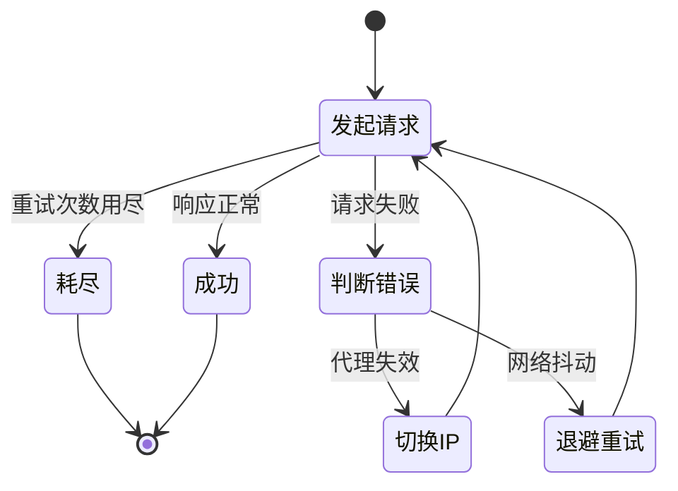

# 代理与重试指南

本页说明如何配置代理池与重试策略，在请求失败时自动切换 IP 并重试。

## 失败重试状态机

请求失败后按代理可用性切换出口 IP，直至成功或耗尽重试次数。

```mermaid
stateDiagram-v2
    [*] --> 发起请求
    发起请求 --> 成功: 响应正常
    发起请求 --> 判断错误: 请求失败
    判断错误 --> 切换IP: 代理失效
    判断错误 --> 退避重试: 网络抖动
    切换IP --> 发起请求
    退避重试 --> 发起请求
    发起请求 --> 耗尽: 重试次数用尽
    耗尽 --> [*]
    成功 --> [*]
```

> 本页内容将在后续任务填充。
