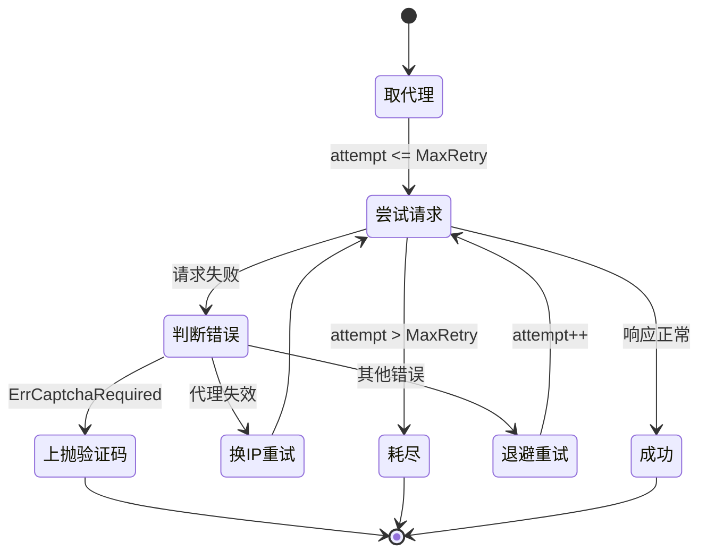
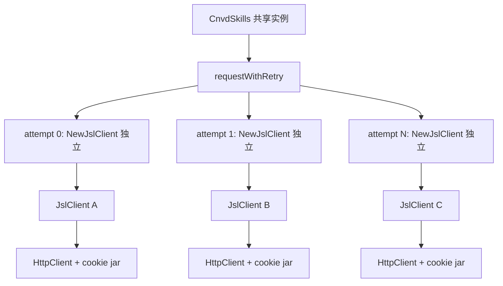

# 代理与重试

cnvd-skills 通过 `ProxyProvider` 接入代理源，`requestWithRetry` 统一封装请求层重试：代理类错误换 IP 重试、非代理错误按 `MaxRetry` 重试、验证码类错误不重试直接上抛。

## ProxyProvider 接口

`ProxyProvider` 是一个返回代理 URL 的函数，每次调用可返回新 IP：

```go
type ProxyProvider func() (string, error)
```

内置两个实现：

| 实现 | 说明 |
|------|------|
| `FixedProxyProvider(proxy)` | 始终返回固定 IP，传空串表示直连，测试用 |
| `PinYiProxyProvider()` | 品易代理 API（注：其源已下线，DNS 无法解析，仅供兼容） |

自定义代理源只需实现 `func() (string, error)` 签名，返回 `http://ip:port` 格式：

```go
var myProxy cnvd_skills.ProxyProvider = func() (string, error) {
    return "http://127.0.0.1:8080", nil
}
err := skills.VulList(ctx, myProxy, cfg)
```

## 重试状态机

`requestWithRetry` 按错误类型走不同分支。代理错误不消耗 `MaxRetry` 配额，持续换 IP 重试；非代理错误在 `MaxRetry` 次内重试；验证码错误（`ErrCaptchaRequired`）立即上抛：



## 代理错误判定

`isProxyInvalid` 覆盖以下错误特征，命中即归类为代理错误（应换 IP 重试）：

- `read tcp ` 前缀（TCP 读错误）
- `unexpected EOF` 后缀
- 含 `proxyconnect`（代理连接拒绝）
- 含 `EOF`
- 含 `connection refused`
- 含 `i/o timeout`
- 含 `context deadline exceeded`（context 超时）

## requestWithRetry 源码要点

```go
func (x *CnvdSkills) requestWithRetry(ctx context.Context, proxyProvider ProxyProvider, config *Config, targetUrl string) (string, error) {
    proxy, err := proxyProvider()  // 首次取代理
    // ...
    for attempt := 0; attempt <= maxRetry; attempt++ {
        client := jsl.NewJslClient(proxy, timeoutSec, solver)  // 每次派生独立实例
        body, getErr := client.Get(ctx, targetUrl)
        if getErr == nil {
            return body, nil
        }
        if isProxyInvalid(getErr) {
            // 代理错误：等 ProxyRetryIntervalSeconds，换 IP，重试（不消耗 attempt）
            jitterSleep-equivalent wait...
            proxy, _ = proxyProvider()
            continue
        }
        if errors.Is(getErr, jsl.ErrCaptchaRequired) {
            return "", getErr  // 验证码错误不重试
        }
        // 其他错误：等 ProxyRetryIntervalSeconds，attempt++ 重试
    }
    return "", lastErr
}
```

> 注：代理错误分支的 `continue` 不递增 `attempt`，但循环条件是 `attempt <= maxRetry`，因此代理错误会持续重试直到成功或 ctx 取消。调用方应通过 `context.WithTimeout` 控制总时长。

## 并发安全

`requestWithRetry` 每次尝试都 `jsl.NewJslClient(proxy, timeoutSec, solver)` 派生独立客户端，不修改 `CnvdSkills` 持有的共享实例，保证并发安全。详见 [并发安全模型](./concurrency)。



## 用法

直连（无代理）：

```go
err := skills.VulList(ctx, cnvd_skills.FixedProxyProvider(""), cfg)
```

固定代理：

```go
err := skills.VulList(ctx, cnvd_skills.FixedProxyProvider("http://127.0.0.1:8080"), cfg)
```

自定义代理源 + 超时控制：

```go
ctx, cancel := context.WithTimeout(context.Background(), 10*time.Minute)
defer cancel()
err := skills.VulList(ctx, myProxyProvider, cfg)
```

## ctx 取消

全程响应 `ctx` 取消，含飞行中 HTTP 请求。`requestWithRetry` 每次循环开头检查 `ctx.Done()`，`jitterSleep` 内部用 `select` 监听 `ctx.Done()` 与 `time.After`，取消时立即返回。

## 关键 API

| 方法 | 说明 |
|------|------|
| `requestWithRetry(ctx, proxyProvider, config, targetUrl) (string, error)` | 请求层重试（内部方法） |
| `FixedProxyProvider(proxy) ProxyProvider` | 固定代理 |
| `PinYiProxyProvider() (string, error)` | 品易代理（兼容保留） |
| `isProxyInvalid(err) bool` | 代理错误判定（内部） |

详见 [Proxy API](/api-cnvd-skills/proxy)。

## 下一步

- [并发安全模型](./concurrency) 独立客户端派生机制
- [配置](./config) MaxRetry / ProxyRetryIntervalSeconds 说明
- [验证码识别器指南](./captcha-solver-guide) 验证码错误处理
- [常见问题排查](./troubleshooting) 代理失效排查
