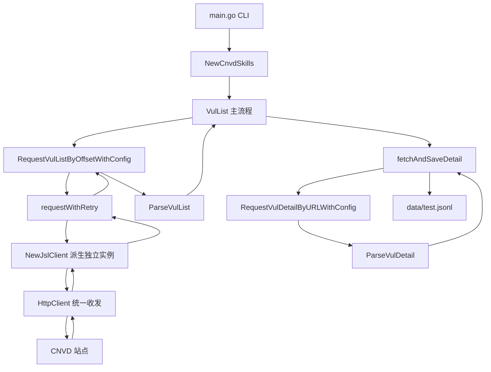

# CLI 直接运行

cnvd-skills 仓库根目录 `main.go` 编译为 `cnvd-skills` 可执行文件，无需写代码即可运行全量抓取。本页说明 CLI 的两种运行方式与它如何映射到底层 SDK 调用。

## 运行方式

### 方式一：go run

开发期直接 `go run`，无需编译产物：

```bash
cd cnvd-skills
go run . 
```

### 方式二：编译后运行

```bash
go build -o cnvd-skills .
./cnvd-skills
```

或下载 [GitHub Releases](https://github.com/scagogogo/cnvd-skills/releases) 预编译二进制（见 [安装](./installation)）：

```bash
tar -xzf cnvd-skills_*_linux_amd64.tar.gz
./cnvd-skills
```

## main.go 行为

`main.go` 极简：用 `PinYiProxyProvider` 与 `DefaultConfig()` 调用 `VulList` 主流程，输出到 `data/test.jsonl`：

```go
package main

import (
    "context"
    "fmt"
    "github.com/scagogogo/cnvd-skills/cnvd_skills"
)

func main() {
    ctx := context.Background()
    err := cnvd_skills.NewCnvdSkills().VulList(ctx, cnvd_skills.PinYiProxyProvider, cnvd_skills.DefaultConfig())
    if err != nil {
        fmt.Println("抓取出错： " + err.Error())
    } else {
        fmt.Println("正常退出！")
    }
}
```

> 注：`PinYiProxyProvider` 其源已下线（DNS 无法解析），仅供兼容。实际使用请改为 `cnvd_skills.FixedProxyProvider("")` 直连，或实现自定义 `ProxyProvider`。详见 [代理与重试](./proxy-retry)。

## CLI 与库的调用关系

CLI 只是 `cnvd_skills` 包的薄封装，所有逻辑在库内。下图展示 CLI 启动到落盘的完整调用链：



## 自定义 CLI

`main.go` 没有命令行参数（flag），所有配置硬编码在源码中。要调整代理、输出路径、节奏或验证码识别器，直接改 `main.go` 重新编译：

```go
func main() {
    cfg := &cnvd_skills.Config{
        OutputPath:                "data/cnvd.jsonl",
        ListPageIntervalSeconds:   5,
        DetailIntervalSeconds:     4,
        Jitter:                    0.5,
        CaptchaSolver: jsl.CommandCaptchaSolver{
            Command: "python3",
            Args:    []string{"scripts/ddddocr_solver.py"},
        },
    }
    err := cnvd_skills.NewCnvdSkills().VulList(
        context.Background(),
        cnvd_skills.FixedProxyProvider(""), // 直连
        cfg,
    )
    // ...
}
```

## 运行结果

成功时输出 `正常退出！`，并在 `data/test.jsonl` 产生逐行 JSON。失败时输出 `抓取出错： <error>`，常见错误见 [常见问题排查](./troubleshooting)。

## CLI vs SDK 对比

| 场景 | CLI（main.go） | SDK（go get） |
|------|------|------|
| 快速跑全量 | 改 main.go 重编译 | 集成进现有项目 |
| 自定义代理 | 改源码 | 传 `ProxyProvider` 参数 |
| 验证码识别 | 改 Config | 配置 `CaptchaSolver` |
| 单条抓取 | 不支持 | `FetchVulDetail` |
| 列表检索 | 不支持 | `VulListWithQuery` |

CLI 适合一次性全量抓取，SDK 适合集成与定制化场景。

## 下一步

- [安装](./installation) 编译与下载
- [快速开始](./getting-started) SDK 用法
- [配置](./config) Config 字段说明
- [漏洞列表抓取](./vul-list) 主流程细节
