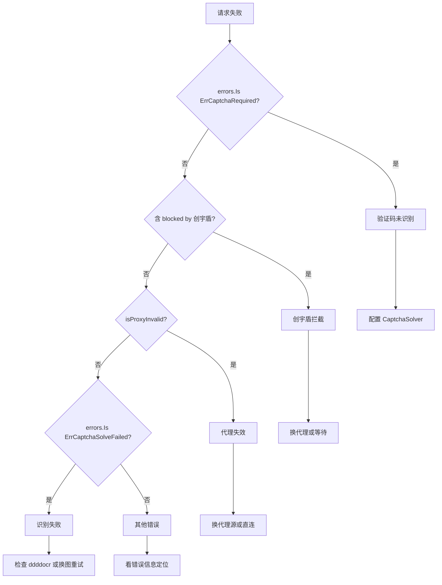

# 常见问题排查

本页汇总 cnvd-skills 抓取过程中最常见的错误，按错误类型分类给出排查思路与解决方案。

## 错误分类决策树

遇到错误时，先用 `errors.Is` 与错误信息判断属于哪一类，再对号入座排查：



## ErrCaptchaRequired

**现象**：请求返回 `captcha challenge required but no solver configured`。

**原因**：CNVD 对当前 IP 触发了图片验证码挑战，但 `Config.CaptchaSolver` 未配置（`nil`）或配置了 `NoopCaptchaSolver`。

**排查**：

```go
import "errors"

if errors.Is(err, jsl.ErrCaptchaRequired) {
    // 需配置识别器
}
```

**解决**：配置 `CommandCaptchaSolver` 调 ddddocr 自动识别，或改用直连 IP（不同 IP 触发验证码的概率不同）：

```go
cfg := &cnvd_skills.Config{
    CaptchaSolver: jsl.CommandCaptchaSolver{
        Command: "python3",
        Args:    []string{"scripts/ddddocr_solver.py"},
    },
}
```

详见 [验证码识别器指南](./captcha-solver-guide)。

## 创宇盾拦截

**现象**：错误信息含 `blocked by 创宇盾 (proxy may be banned)`。

**原因**：响应体含 `当前访问疑似黑客攻击，已被创宇盾拦截。`，通常是代理 IP 被 CNVD 风控封禁。

**排查**：`JslClient.plainRequest` 检测到创宇盾拦截页时返回此错误。

**解决**：

1. 换代理 IP（`ProxyProvider` 返回新 IP）
2. 降低抓取频率（增大 `ListPageIntervalSeconds` / `DetailIntervalSeconds`）
3. 增大 `Jitter`（默认 0.3，可调到 0.5）
4. 直连（`FixedProxyProvider("")`），不同 IP 触发风控的概率不同

## 代理失效

**现象**：错误信息含 `read tcp `、`unexpected EOF`、`proxyconnect`、`connection refused`、`i/o timeout`、`context deadline exceeded` 等关键字。

**原因**：代理 IP 不可用（失效、被拒、超时）。`isProxyInvalid` 判定为代理错误后 `requestWithRetry` 会换 IP 重试。

**排查**：

- 若持续代理失效：`ProxyProvider` 返回的 IP 全部不可用，检查代理源
- `PinYiProxyProvider` 其源已下线（DNS 无法解析），改用 `FixedProxyProvider("")` 直连或自定义代理源
- 单次代理失效是正常的，库会自动换 IP 重试

**解决**：

```go
// 直连
err := skills.VulList(ctx, cnvd_skills.FixedProxyProvider(""), cfg)

// 自定义代理源
var myProxy cnvd_skills.ProxyProvider = func() (string, error) {
    return "http://127.0.0.1:8080", nil
}
```

详见 [代理与重试](./proxy-retry)。

## 验证码识别失败

**现象**：请求返回 `captcha solve failed after retries`（`ErrCaptchaSolveFailed`）。

**原因**：配置了 `CaptchaSolver`，但识别器返回错误或答案错误，连续 6 次均失败。

**排查**：

1. ddddocr 未安装或版本不兼容：`pip3 install ddddocr`
2. `CommandCaptchaSolver` 的 `Command`/`Args` 路径错误：确认 `scripts/ddddocr_solver.py` 存在且可执行
3. 验证码图为中文词组，OCR 有概率性：偶发失败重跑即可
4. 外部命令超时：`RequestTimeoutSeconds` 过小导致子进程被杀

**解决**：

```go
// 验证 ddddocr 可用
// echo "<base64>" | python3 scripts/ddddocr_solver.py

// 增大超时
cfg := &cnvd_skills.Config{
    RequestTimeoutSeconds: 60,
    CaptchaSolver: jsl.CommandCaptchaSolver{
        Command: "python3",
        Args:    []string{"scripts/ddddocr_solver.py"},
    },
}
```

## 请求超时

**现象**：错误含 `context deadline exceeded`。

**原因**：单次请求超过 `RequestTimeoutSeconds`。可能是代理慢、网络抖动、或 CNVD 响应慢。

**解决**：增大 `RequestTimeoutSeconds`（默认 30，可调到 60）。注意 `isProxyInvalid` 把 `context deadline exceeded` 归为代理错误，会换 IP 重试而非直接失败。

## 输出文件权限

**现象**：`open data/test.jsonl: permission denied` 或 `no such file or directory`。

**原因**：`OutputPath` 父目录不可写或路径非法。

**解决**：`fetchAndSaveDetail` 内部 `os.MkdirAll(parentDir(config.OutputPath), os.ModePerm)` 会创建父目录，确保父目录可写。检查 `OutputPath` 路径权限。

## 抓取结果 CNVD 为空

**现象**：`FetchVulDetailWithConfig` 返回 `parsed detail for CNVD-xxx has empty CNVD-ID`。

**原因**：`ParseVulDetail` 解析出的 `CNVD` 字段为空，通常是详情页结构变化或返回了非详情页内容（如验证码页、错误页）。

**排查**：检查 CNVD-ID 是否正确（格式 `CNVD-YYYY-NNNNN`），网络是否正常返回真实详情页。

## 抓取卡住不动

**现象**：长时间无输出，进程未退出。

**排查**：

1. ctx 未设超时：用 `context.WithTimeout` 控制总时长
2. 代理错误持续重试：`requestWithRetry` 代理错误分支不消耗 `MaxRetry`，会持续换 IP 重试直到成功或 ctx 取消
3. `jitterSleep` 休眠中：正常节奏，等间隔结束

**解决**：

```go
ctx, cancel := context.WithTimeout(context.Background(), 10*time.Minute)
defer cancel()
err := skills.VulList(ctx, proxy, cfg)
```

## 关键错误速查

| 错误 | 含义 | 处理 |
|------|------|------|
| `jsl.ErrCaptchaRequired` | 遇验证码但未配识别器 | 配 `CaptchaSolver` |
| `jsl.ErrCaptchaSolveFailed` | 识别 6 次均失败 | 检查 ddddocr，重跑 |
| `blocked by 创宇盾` | IP 被风控 | 换代理或直连 |
| `read tcp` / `EOF` / `connection refused` | 代理失效 | 库自动换 IP，持续则换代理源 |
| `context deadline exceeded` | 请求超时 | 增大超时或换 IP |
| `parsed detail has empty CNVD-ID` | 详情解析异常 | 检查 CNVD-ID 与网络 |

## 调试技巧

- `ParseVulList` / `ParseVulDetail` / `ParseVulPatch` 接受纯字符串入参，可把响应 HTML 存本地离线调试
- 离线测试不依赖网络：`go test ./cnvd_skills/ -short -v`
- 真实集成测试：`go test ./cnvd_skills/ -run "_Real" -v -timeout 400s`

## 下一步

- [验证码识别器指南](./captcha-solver-guide) 验证码错误处理
- [代理与重试](./proxy-retry) 代理错误处理
- [配置](./config) 超时与重试参数
- [go-jsl 错误变量](/api-gojsl/errors) 错误类型定义
