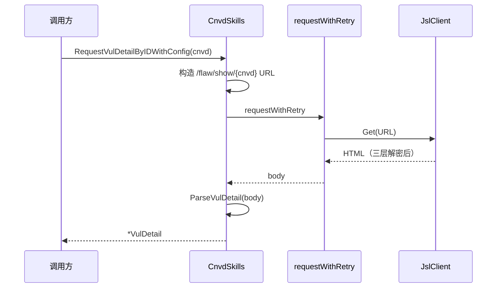
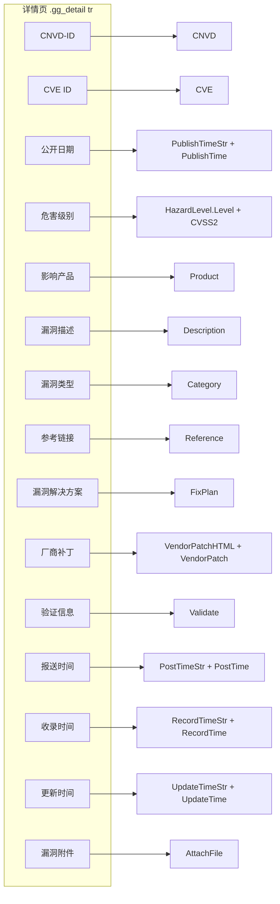

# 漏洞详情

按 CNVD-ID 或详情页 URL 抓取并解析单条漏洞详情。`VulDetail` 共 21 个字段，涵盖编号、时间、危害、产品、描述、参考、补丁、附件等。

## 用法

按 CNVD-ID 抓取（带 config 以通过验证码）：

```go
cfg := &cnvd_skills.Config{
    MaxRetry:              3,
    RequestTimeoutSeconds: 30,
    CaptchaSolver:         solver,
}
detail, err := cnvd_skills.NewCnvdSkills().RequestVulDetailByIDWithConfig(
    context.Background(),
    "CNVD-2021-67823",
    cnvd_skills.FixedProxyProvider(""),
    cfg,
)
if err == nil {
    fmt.Println(detail.CNVD, detail.CVE, detail.HazardLevel.Level)
}
```

不落盘的单条抓取（`FetchVulDetailWithConfig` 内部校验 CNVD 非空）：

```go
detail, err := cnvd_skills.NewCnvdSkills().FetchVulDetailWithConfig(
    context.Background(), "CNVD-2021-67823",
    cnvd_skills.FixedProxyProvider(""), cfg,
)
```

## 请求流程



## 字段映射

`ParseVulDetail` 遍历 `.gg_detail tr`，按表格行的 key 列匹配填入对应字段。下图展示 HTML 表格行到 `VulDetail` 21 字段的映射：



## 字段速查

`VulDetail` 结构体字段与来源对照，时间字段同时提供字符串与 `*time.Time`：

| 字段 | 类型 | HTML 来源 key |
|------|------|------|
| `URL` | `string` | 请求 URL（解析后回填） |
| `CNVD` | `string` | `CNVD-ID` |
| `CVE` | `string` | `CVE ID` |
| `PublishTimeStr` / `PublishTime` | `string` / `*time.Time` | `公开日期` |
| `HazardLevel` | `*HazardLevel` | `危害级别`（评级 + CVSS2） |
| `Product` | `string` | `影响产品` |
| `Description` | `string` | `漏洞描述` |
| `Category` | `string` | `漏洞类型` |
| `Reference` | `string` | `参考链接` |
| `FixPlan` | `string` | `漏洞解决方案` |
| `VendorPatchHTML` / `VendorPatch` | `string` / `*VendorPatch` | `厂商补丁`（原始 HTML + 结构化链接） |
| `Validate` | `string` | `验证信息` |
| `PostTimeStr` / `PostTime` | `string` / `*time.Time` | `报送时间` |
| `RecordTimeStr` / `RecordTime` | `string` / `*time.Time` | `收录时间` |
| `UpdateTimeStr` / `UpdateTime` | `string` / `*time.Time` | `更新时间` |
| `AttachFile` | `string` | `漏洞附件` |

详见 [VulDetail API](/api-cnvd-skills/vul-detail) 与 [字段速查](/api-cnvd-skills/fields-reference)。

## 时间解析

`parseCnvdDate` 依次尝试 4 种 layout，全部失败返回 `nil`（不报错，调用方用 `*Str` 字段兜底）：

```go
layouts := []string{
    "2006-01-02 15:04:05",
    "2006-01-02",
    "2006/01/02 15:04:05",
    "2006/01/02",
}
```

## 危害级别解析

`parseHazardLevel` 从 `危害级别` 单元格解析评级与 CVSS2 评分。优先取子元素文本作为评级，回退到纯文本按 `(` 分割。CVSS2 评分从 `(...)` 中提取。

```go
// 示例值 "高危 (7.5)" → Level="高危", CVSS2="7.5"
```

## 离线解析

`ParseVulDetail` 接受纯字符串入参，可用本地 HTML fixture 离线测试，无需网络与代理：

```go
skills := cnvd_skills.NewCnvdSkills()
htmlBytes, _ := os.ReadFile("testdata/detail.html")
detail, err := skills.ParseVulDetail(string(htmlBytes))
```

## 厂商补丁关联

`VendorPatch` 字段含补丁详情页相对链接（如 `/patchInfo/show/289241`）与标题，可进一步调用 `RequestVulPatchByURLWithConfig` 抓取补丁详情。详见 [厂商补丁](./vul-patch)。

## 下一步

- [厂商补丁](./vul-patch) 补丁详情抓取
- [VulDetail API](/api-cnvd-skills/vul-detail) 完整字段文档
- [输出格式](./output-format) JSONL 落盘结构
- [字段速查](/api-cnvd-skills/fields-reference) 全字段速查表
