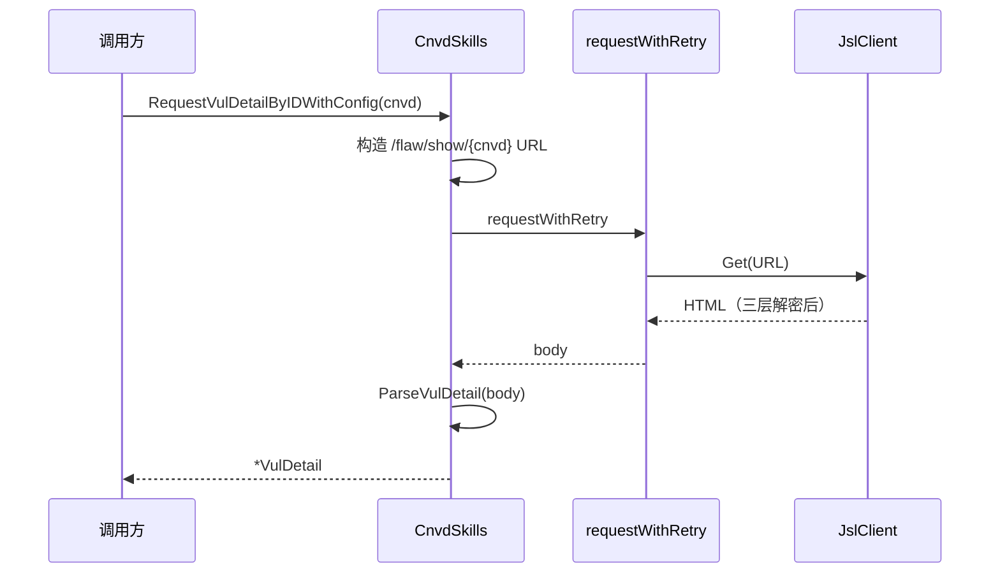

# 漏洞详情

按 CNVD-ID 或详情页 URL 抓取并解析单条漏洞详情。

## 用法

```go
// 按 CNVD-ID（带 config 以通过验证码）
cfg := &cnvd_skills.Config{CaptchaSolver: solver}
detail, err := cnvd_skills.NewCnvdSkills().RequestVulDetailByIDWithConfig(
    context.Background(),
    "CNVD-2021-67823",
    cnvd_skills.FixedProxyProvider(""),
    cfg,
)

// 不落盘的单条抓取
detail, err := cnvd_skills.NewCnvdSkills().FetchVulDetailWithConfig(
    context.Background(), "CNVD-2021-67823", proxy, cfg,
)
```

## 请求流程



## 解析字段

`ParseVulDetail` 从详情页 HTML 解析出：

| 字段 | 来源 |
|------|------|
| CNVD / CVE | 详情页标题区 |
| PublishTime | 公开日期 |
| HazardLevel | 危害级别（评级 + CVSS2） |
| Product | 影响产品 |
| Description | 漏洞描述 |
| Category | 漏洞类型 |
| Reference | 参考链接 |
| FixPlan | 解决方案 |
| VendorPatch | 厂商补丁（链接 + 标题） |
| AttachFile | 漏洞附件 |

时间字段同时提供字符串与 `*time.Time`。详见 [VulDetail API](/api-cnvd-skills/vul-detail)。

## 离线解析

`ParseVulDetail` 接受纯字符串入参，可用本地 HTML fixture 离线测试，无需网络：

```go
detail, err := skills.ParseVulDetail(localHTMLString)
```
