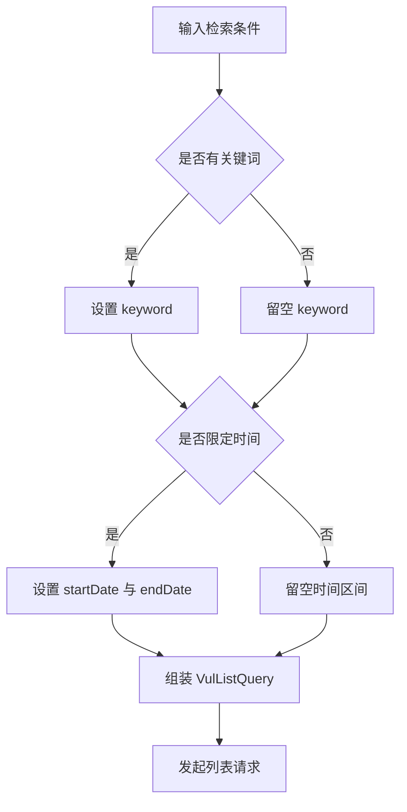

# 列表检索指南

本页说明如何使用 VulListQuery 构造检索参数，从 CNVD 列表中按条件筛选漏洞。

## 查询参数拼装

通过 keyword、startDate、endDate 等字段组装查询请求。

```mermaid
flowchart TD
    A[输入检索条件] --> B{是否有关键词}
    B -- 是 --> C[设置 keyword]
    B -- 否 --> D[留空 keyword]
    C --> E{是否限定时间}
    D --> E
    E -- 是 --> F[设置 startDate 与 endDate]
    E -- 否 --> G[留空时间区间]
    F --> H[组装 VulListQuery]
    G --> H
    H --> I[发起列表请求]
```

> 本页内容将在后续任务填充。
