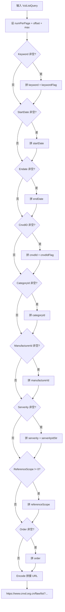
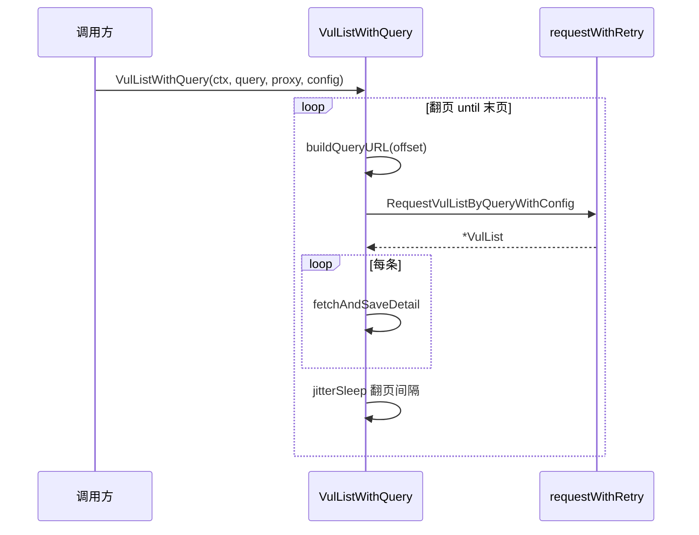

# 列表检索

`VulListQuery` 封装 CNVD 列表页的检索条件，字段名对应 CNVD 真实表单字段。零值字段不拼入查询，按 CNVD 默认行为处理。配合 `RequestVulListByQuery` 单页抓取或 `VulListWithQuery` 全量翻页。

## 字段总览

| 字段 | 类型 | 对应表单字段 | 说明 |
|------|------|------|------|
| `Keyword` | `string` | `keyword` | 关键词，匹配标题/描述等 |
| `KeywordFlag` | `int` | `keywordFlag` | 关键词逻辑：0=与(AND)，1=或(OR) |
| `StartDate` | `string` | `startDate` | 起始公开日期，格式 `2006-01-02` |
| `Endate` | `string` | `endDate` | 截止公开日期（字段名避开内置冲突） |
| `CnvdID` | `string` | `cnvdId` | 按 CNVD-ID 检索 |
| `CnvdIDFlag` | `int` | `cnvdIdFlag` | CNVD-ID 逻辑：0=与，1=或 |
| `CategoryId` | `string` | `categoryId` | 漏洞类别 ID（CNVD 内部编号） |
| `ManufacturerId` | `string` | `manufacturerId` | 厂商 ID（CNVD 内部编号） |
| `Serverity` | `string` | `serverity` + `serverityIdStr` | 危害级别 ID |
| `ReferenceScope` | `int` | `referenceScope` | 参考编号范围：-1=无,1=CVE,2=BID,3=其他 |
| `Order` | `string` | `order` | 排序方式 |
| `NumPerPage` | `int` | `numPerPage` + `max` | 每页条数，0 时用默认 10 |

## 查询参数拼装流程

`buildQueryURL` 内部用 `url.Values` 构造查询串，非空字段才拼入，`Endate` 字段映射为表单 `endDate`：



## 用法

按关键词 + 日期范围单页抓取（带 config 以通过验证码）：

```go
q := cnvd_skills.VulListQuery{
    Keyword:   "XStream",
    StartDate: "2024-01-01",
    Endate:    "2024-12-31",
}
list, err := cnvd_skills.NewCnvdSkills().RequestVulListByQueryWithConfig(
    context.Background(),
    q,
    0, // offset 从 0 开始
    cnvd_skills.FixedProxyProvider(""),
    cfg,
)
```

按 CNVD-ID 精确检索：

```go
q := cnvd_skills.VulListQuery{CnvdID: "CNVD-2021-67823"}
list, err := skills.RequestVulListByQuery(ctx, q, 0, proxy)
```

按厂商 + 危害级别全量翻页落盘：

```go
q := cnvd_skills.VulListQuery{
    ManufacturerId: "xxx",
    Serverity:      "2", // 高危
}
err := skills.VulListWithQuery(ctx, q, proxy, cfg)
```

## 关键 API

| 方法 | 说明 |
|------|------|
| `RequestVulListByQuery(ctx, query, offset, proxyProvider) (*VulList, error)` | 单页检索（无 config） |
| `RequestVulListByQueryWithConfig(ctx, query, offset, proxyProvider, config) (*VulList, error)` | 单页检索（带 config） |
| `VulListWithQuery(ctx, query, proxyProvider, config) error` | 按检索条件翻页+详情+落盘 |

详见 [VulListQuery API](/api-cnvd-skills/vul-list-query)。

## VulListWithQuery 主流程

`VulListWithQuery` 与 `VulList` 区别仅在于先用 `query` 过滤再翻页，`query` 为零值时等价于全量抓取。翻页停止条件、详情落盘、去重逻辑完全一致：



## 字段命名说明

`Endate` 字段名刻意避开 Go 内置的 `endDate` 命名冲突，在 `buildQueryURL` 内映射为 CNVD 表单的 `endDate` 参数。`Serverity` 是 CNVD 表单的真实拼写（非 severity），保留以对齐后端字段。

## 下一步

- [漏洞列表抓取](./vul-list) 全量翻页主流程
- [VulListQuery API](/api-cnvd-skills/vul-list-query) 完整字段文档
- [配置](./config) config 参数说明
