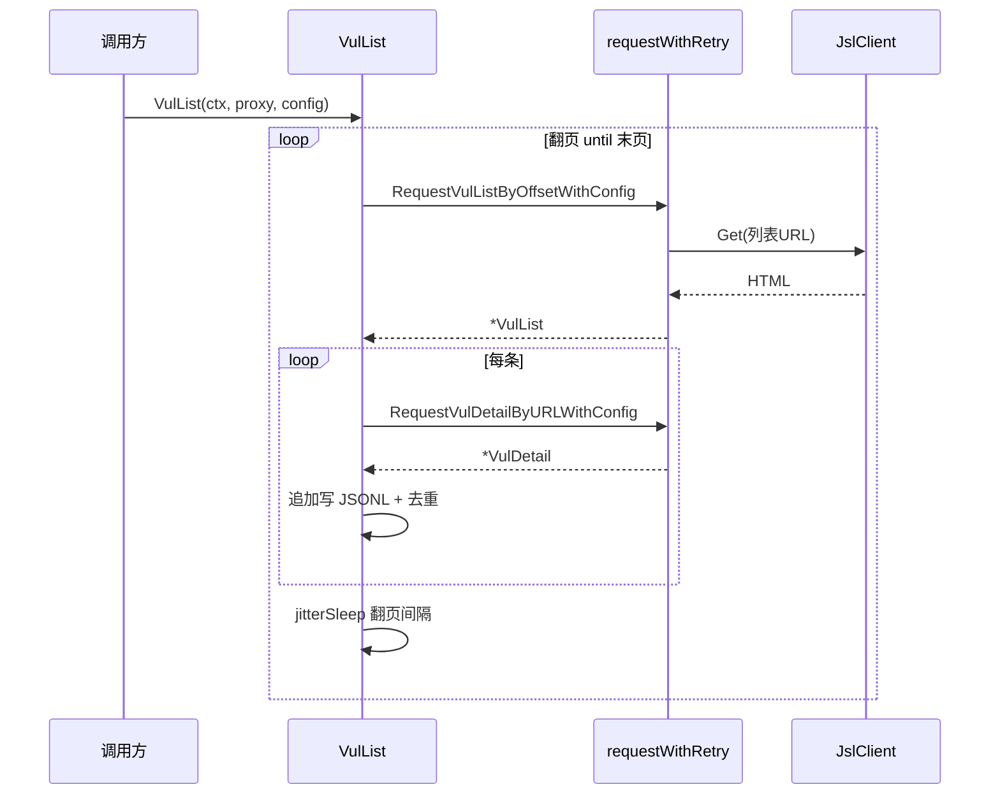
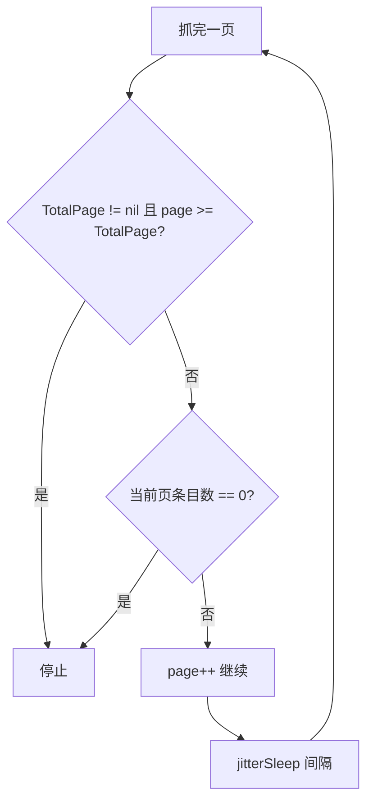

# 漏洞列表抓取

`VulList` 主流程：翻页抓取列表 → 逐条抓详情 → JSONL 落盘。

## 主流程时序



## 用法

```go
err := cnvd_skills.NewCnvdSkills().VulList(
    context.Background(),
    cnvd_skills.FixedProxyProvider(""),
    cnvd_skills.DefaultConfig(),
)
```

## 关键 API

- `VulList(ctx, proxyProvider, config) error` — 主流程
- `RequestVulListByOffset(ctx, offset, proxyProvider) (*VulList, error)` — 单页
- `RequestVulListByOffsetWithConfig(ctx, offset, proxyProvider, config) (*VulList, error)` — 带 config
- `ParseVulList(responseBody string) (*VulList, error)` — 离线解析

详见 [VulList API 参考](/api-cnvd-skills/vul-list)。

## 停止条件

满足任一即停：



## 输出格式

`data/test.jsonl` 每行一个 `VulDetail` JSON：

```json
{"CNVD":"CNVD-2021-67823","CVE":"CVE-2021-39149","Product":"...","Description":"..."}
```

`EnableDedup` 开启时，启动时读已抓 CNVD 集合，重复条目跳过，支持断点续抓。
