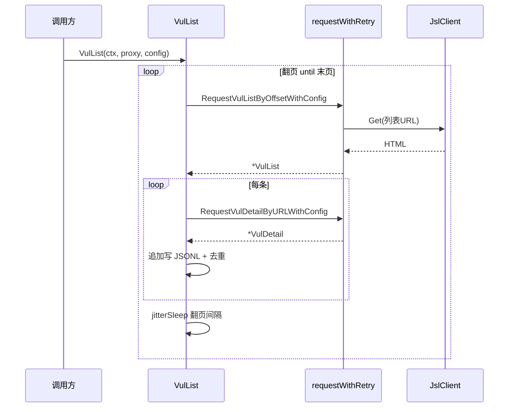
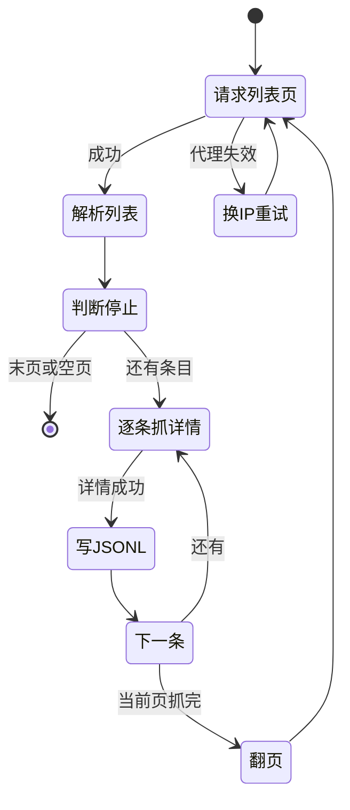
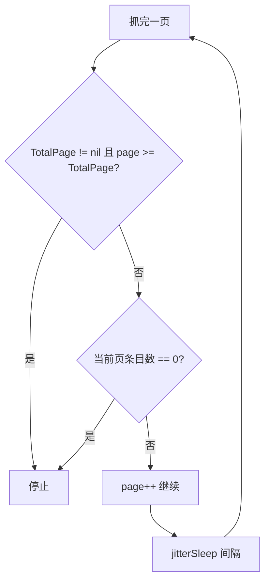

# 漏洞列表抓取

`VulList` 是 cnvd-skills 的主流程：翻页抓取列表 → 逐条抓详情 → JSONL 落盘。带 `TotalPage` 时按总页数停止，否则持续翻页直到当前页条目为空。

## 主流程时序

调用方发起一次 `VulList`，内部循环翻页，每页拉取后逐条抓详情并写文件：



## 用法

最小调用，直连 CNVD、默认配置：

```go
err := cnvd_skills.NewCnvdSkills().VulList(
    context.Background(),
    cnvd_skills.FixedProxyProvider(""),
    cnvd_skills.DefaultConfig(),
)
```

带验证码识别器与自定义节奏：

```go
cfg := &cnvd_skills.Config{
    ListPageIntervalSeconds: 5,
    DetailIntervalSeconds:   4,
    Jitter:                  0.5,
    CaptchaSolver: jsl.CommandCaptchaSolver{
        Command: "python3",
        Args:    []string{"scripts/ddddocr_solver.py"},
    },
}
err := cnvd_skills.NewCnvdSkills().VulList(ctx, cnvd_skills.FixedProxyProvider(""), cfg)
```

## 翻页状态机

`VulList` 内部循环的状态转换。代理错误换 IP 重试同一页，正常抓完后判断停止条件：



## 关键 API

| 方法 | 说明 |
|------|------|
| `VulList(ctx, proxyProvider, config) error` | 主流程，翻页+详情+落盘 |
| `RequestVulListByOffset(ctx, offset, proxyProvider) (*VulList, error)` | 单页抓取（无 config） |
| `RequestVulListByOffsetWithConfig(ctx, offset, proxyProvider, config) (*VulList, error)` | 单页抓取（带 config） |
| `ParseVulList(responseBody string) (*VulList, error)` | 离线解析列表 HTML |
| `VulListWithQuery(ctx, query, proxyProvider, config) error` | 按检索条件翻页（见 [列表检索](./vul-list-query)） |

详见 [VulList API 参考](/api-cnvd-skills/vul-list)。

## 停止条件

满足任一即停：



`ParseVulList` 优先从 `span.totalPage` 解析总页数，缺失时回退到分页链接 `a.step` 的最大值，保证 `TotalPage` 字段尽量可用。

## 翻页 offset 计算

`VulList` 按 `(page-1)*NumPerPage` 计算列表请求的 offset，URL 形如 `https://www.cnvd.org.cn/flaw/list?numPerPage=10&offset={offset}&max=10`。`page` 从 1 开始，末页判断后才 `page++`。

```go
offset := (page - 1) * config.NumPerPage
list, err := x.RequestVulListByOffsetWithConfig(ctx, offset, proxyProvider, config)
```

## 输出格式

`data/test.jsonl` 每行一个 `VulDetail` JSON：

```json
{"CNVD":"CNVD-2021-67823","CVE":"CVE-2021-39149","Product":"...","Description":"..."}
```

`EnableDedup` 开启时，启动时读已抓 CNVD 集合，重复条目跳过，支持断点续抓。详见 [输出格式](./output-format) 与 [去重机制](./dedup)。

## 代理错误处理

`VulList` 与 `fetchAndSaveDetail` 都对代理错误做特殊处理：检测到 `isProxyInvalid(err)` 后 `jitterSleep` 等待再换 IP 重试同一页/同一条，不消耗 `MaxRetry` 配额。详见 [代理与重试](./proxy-retry)。

## 下一步

- [漏洞详情](./vul-detail) 单条详情抓取与解析
- [输出格式](./output-format) JSONL 结构详解
- [去重机制](./dedup) 断点续抓原理
- [代理与重试](./proxy-retry) 代理错误处理
