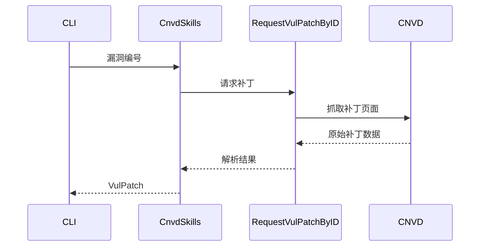

# 厂商补丁抓取指南

本页说明如何通过 CnvdSkills 抓取漏洞对应的厂商补丁信息。

## 补丁抓取流程

调用 RequestVulPatchByID 拉取漏洞关联的厂商补丁地址与说明。

```mermaid
sequenceDiagram
    participant CLI
    participant CnvdSkills
    participant RequestVulPatchByID
    participant CNVD
    CLI->>CnvdSkills: 漏洞编号
    CnvdSkills->>RequestVulPatchByID: 请求补丁
    RequestVulPatchByID->>CNVD: 抓取补丁页面
    CNVD-->>RequestVulPatchByID: 原始补丁数据
    RequestVulPatchByID-->>CnvdSkills: 解析结果
    CnvdSkills-->>CLI: VulPatch
```

> 本页内容将在后续任务填充。
