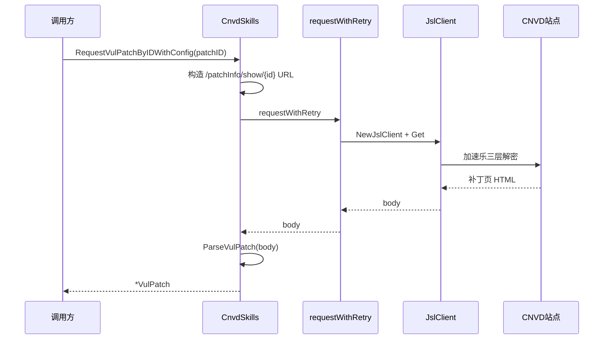
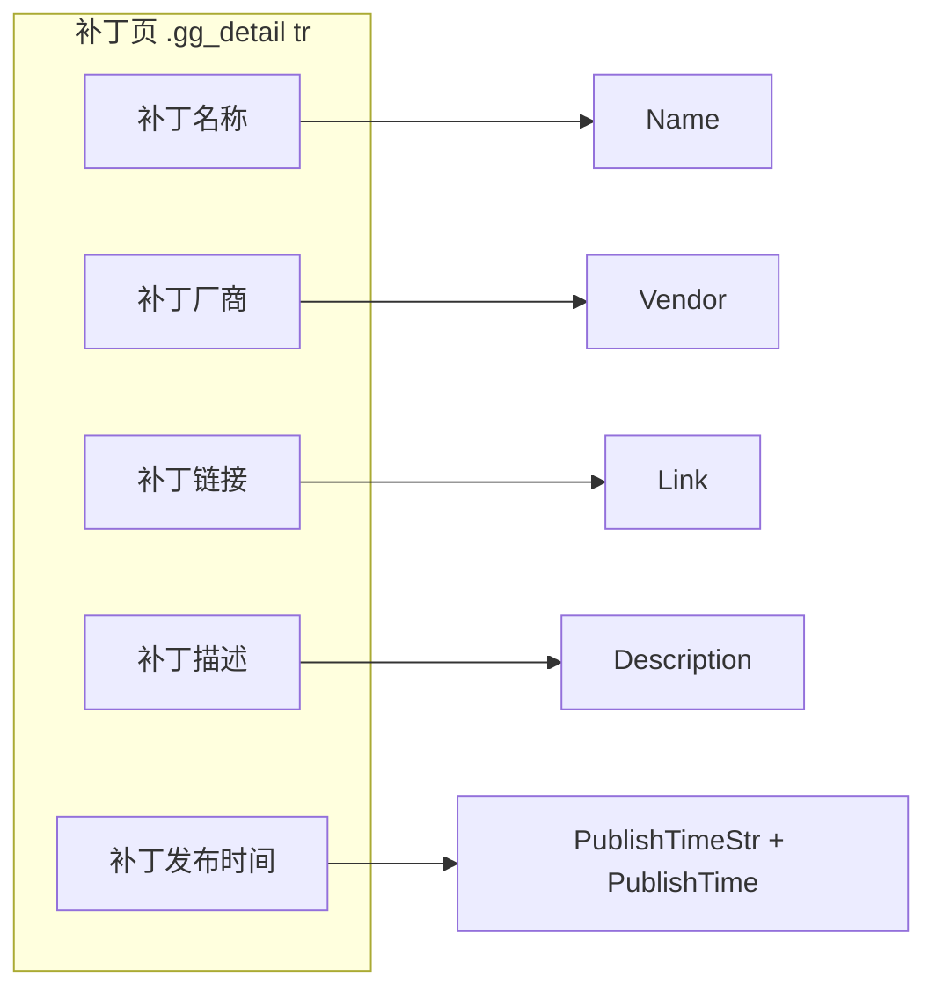

# 厂商补丁抓取

通过 `RequestVulPatchByID` / `RequestVulPatchByURL` 抓取漏洞关联的厂商补丁详情页，`ParseVulPatch` 解析出补丁名称、厂商、链接、描述与发布时间。

## 补丁与详情的关系

`VulDetail.VendorPatch` 字段在解析详情页 `厂商补丁` 行时填充，含补丁详情页相对链接（如 `/patchInfo/show/289241`）与标题。补丁详情页是 CNVD 独立页面 `/patchInfo/show/:id`，结构与详情页类似（`.gg_detail tr` 表格行）。

```mermaid
flowchart LR
    D[VulDetail] --> VP[VendorPatch.Href]
    VP --> URL[/patchInfo/show/289241]
    URL --> RP[RequestVulPatchByURLWithConfig]
    RP --> P[VulPatch]
```

## 请求时序

调用方传入补丁 ID 或完整 URL，`requestWithRetry` 派生独立 `JslClient` 完成加速乐穿透，拿到 HTML 后 `ParseVulPatch` 解析：



## 用法

按补丁 ID 抓取（ID 如 `289241`）：

```go
cfg := &cnvd_skills.Config{
    MaxRetry:              3,
    RequestTimeoutSeconds: 30,
    CaptchaSolver:         solver,
}
patch, err := cnvd_skills.NewCnvdSkills().RequestVulPatchByIDWithConfig(
    context.Background(),
    "289241",
    cnvd_skills.FixedProxyProvider(""),
    cfg,
)
if err == nil {
    fmt.Println(patch.Name, patch.Vendor, patch.Link)
}
```

按完整 URL 抓取（从 `VendorPatch.Href` 拼出绝对 URL）：

```go
patchURL := "https://www.cnvd.org.cn" + detail.VendorPatch.Href
patch, err := skills.RequestVulPatchByURLWithConfig(ctx, patchURL, proxy, cfg)
```

## 关键 API

| 方法 | 说明 |
|------|------|
| `RequestVulPatchByID(ctx, patchID, proxyProvider) (*VulPatch, error)` | 按补丁 ID 抓取（无 config） |
| `RequestVulPatchByIDWithConfig(ctx, patchID, proxyProvider, config) (*VulPatch, error)` | 按补丁 ID 抓取（带 config） |
| `RequestVulPatchByURL(ctx, patchPageURL, proxyProvider) (*VulPatch, error)` | 按 URL 抓取（无 config） |
| `RequestVulPatchByURLWithConfig(ctx, patchPageURL, proxyProvider, config) (*VulPatch, error)` | 按 URL 抓取（带 config） |
| `ParseVulPatch(responseString string) (*VulPatch, error)` | 离线解析补丁页 HTML |

详见 [VulPatch API](/api-cnvd-skills/vul-patch)。

## 字段映射

`ParseVulPatch` 遍历 `.gg_detail tr`，按 key 列匹配填入 `VulPatch` 7 个字段：



| 字段 | 类型 | HTML 来源 key |
|------|------|------|
| `URL` | `string` | 请求 URL（解析后回填） |
| `Name` | `string` | `补丁名称` |
| `Vendor` | `string` | `补丁厂商` |
| `Link` | `string` | `补丁链接`（优先取 `<a href>`，否则取文本） |
| `Description` | `string` | `补丁描述` |
| `PublishTimeStr` / `PublishTime` | `string` / `*time.Time` | `补丁发布时间` |

## 离线解析

`ParseVulPatch` 接受纯字符串入参，可用本地 HTML fixture 离线测试：

```go
htmlBytes, _ := os.ReadFile("testdata/patch.html")
patch, err := skills.ParseVulPatch(string(htmlBytes))
```

## 从详情到补丁的完整链路

抓取一个漏洞并顺带抓取其厂商补丁：

```go
skills := cnvd_skills.NewCnvdSkills()
detail, err := skills.RequestVulDetailByIDWithConfig(ctx, "CNVD-2021-67823", proxy, cfg)
if err != nil {
    return err
}
if detail.VendorPatch != nil && detail.VendorPatch.Href != "" {
    patchURL := "https://www.cnvd.org.cn" + detail.VendorPatch.Href
    patch, err := skills.RequestVulPatchByURLWithConfig(ctx, patchURL, proxy, cfg)
    if err != nil {
        return err
    }
    fmt.Println(patch.Name, patch.Link)
}
```

## 下一步

- [漏洞详情](./vul-detail) 详情页解析
- [VulPatch API](/api-cnvd-skills/vul-patch) 完整字段文档
- [代理与重试](./proxy-retry) 请求层重试机制
